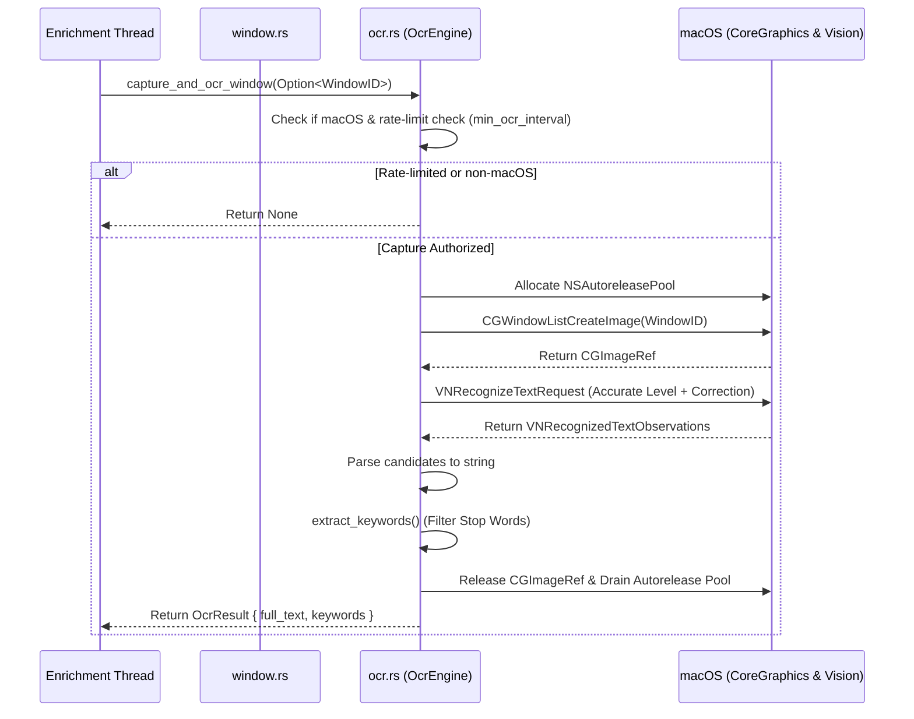
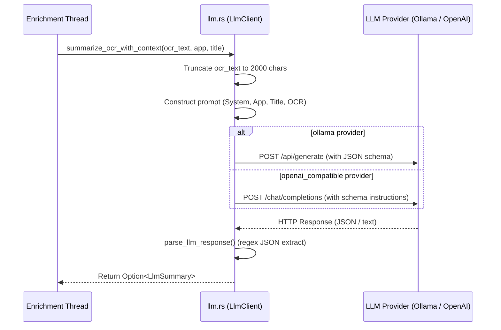
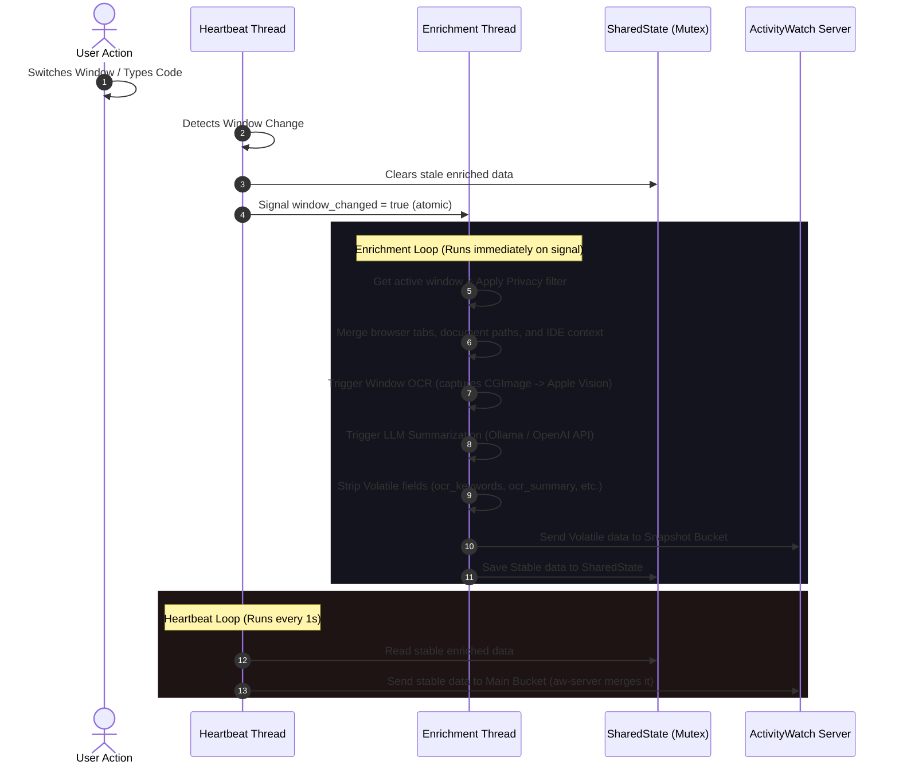
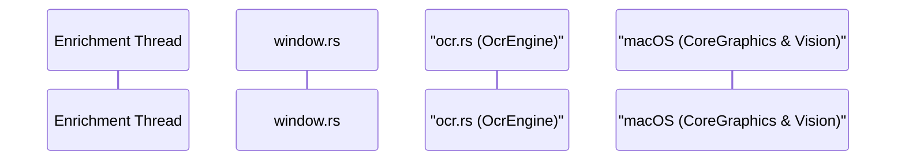
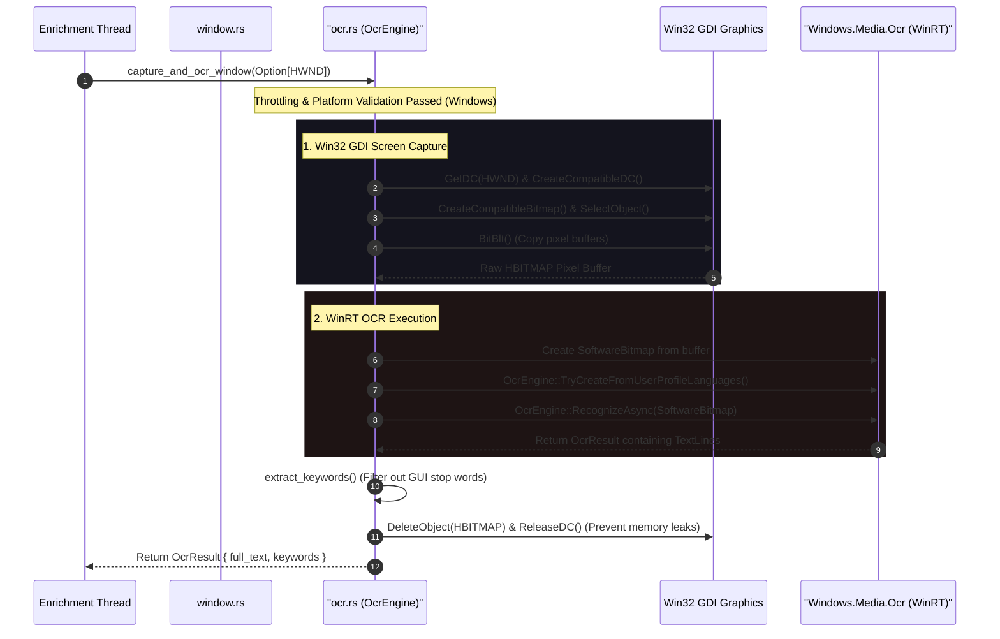

# Analyzing OCR and LLM Features

## Metadata

| Field | Value |
|-------|-------|
| **Trajectory ID** | `2fde8ce3-a32e-4528-993f-230accc6d89e` |
| **Cascade ID** | `e5d41379-4b95-46a1-8d4e-9462c959d819` |
| **Type** | Agent Conversation |
| **Total Steps** | 76 |
| **Started** | 27 May 2026, 4:00 am |
| **Completed** | 27 May 2026, 4:11 am |

---

## User Request

I would like to understand how / when the code uses its enhanced features (aka OCR and LLM) Please analyze the code in the rust-watcher/ sub folders and write up a ANALYSIS.md file explaining what it does and when with references to the code files / lines. Include mermaid diagrams to clearly and easily explain the flow / process

<details>
<summary>Context</summary>

**Active File:** `config.toml`
**Language:** plaintext

**Open Files:**
- `config.toml`
- `meeting.rs`
- `window.rs`
</details>

---

<details>
<summary>Conversation History</summary>

# Conversation History
Here are the conversation IDs, titles, and summaries of your most recent 2 conversations, in reverse chronological order:

<conversation_summaries>
## Conversation aae5c87b-e517-4d5d-ac95-83f341d139e4: Enhancing LLM Startup Error Logging
- Created: 2026-05-26T11:08:45Z
- Last modified: 2026-05-26T11:10:44Z

### USER Objective:
Enhancing LLM Startup Error Logging
Enhance the error handling in `aw-watcher-enhanced` during LLM startup validation so that when model list retrieval or parsing fails, the system logs the full HTTP request (URL, headers, body) and response (status, headers, body as text) to aid in debugging.

## Conversation f75baac4-3ab3-4e23-b3aa-d343872fab4d: Fixing Windows Build Issues
- Created: 2026-05-26T10:59:32Z
- Last modified: 2026-05-26T11:03:04Z

### USER Objective:
Fixing Windows Build Issues
Analyze and resolve the Rust compilation errors encountered when attempting to build `aw-watcher-enhanced` on Windows. Let's do some initial file viewing and checking to build the report.

</conversation_summaries>

</details>

---

### CORTEX_STEP_TYPE_KNOWLEDGE_ARTIFACTS

**Status:** Completed
**Created:** 27 May 2026, 4:00 am

---

## Agent Response

### Actions

**Tool:** `list_dir`
**Path:** `c:\projects\aw-watcher-enhanced\rust-watcher`

<details>
<summary>Metadata</summary>

- **Model:** Gemini 3.5 Flash (High)
</details>

---

<details>
<summary>Directory: `rust-watcher` (4 items)</summary>

**Path:** `c:/projects/aw-watcher-enhanced/rust-watcher`

| Name | Type | Size |
|------|------|------|
| `Cargo.lock` | File | 67400 bytes |
| `Cargo.toml` | File | 1251 bytes |
| `src` | Directory | - |
| `target` | Directory | - |

</details>

---

## Agent Response

### Actions

**Tool:** `list_dir`
**Path:** `c:\projects\aw-watcher-enhanced\rust-watcher\src`

<details>
<summary>Metadata</summary>

- **Model:** Gemini 3.5 Flash (High)
</details>

---

<details>
<summary>Directory: `src` (15 items)</summary>

**Path:** `c:/projects/aw-watcher-enhanced/rust-watcher/src`

| Name | Type | Size |
|------|------|------|
| `aw_client.rs` | File | 4171 bytes |
| `browser.rs` | File | 6010 bytes |
| `categorizer.rs` | File | 19121 bytes |
| `config.rs` | File | 14691 bytes |
| `document.rs` | File | 11215 bytes |
| `file_tracker.rs` | File | 6712 bytes |
| `ide_merger.rs` | File | 11283 bytes |
| `idle.rs` | File | 7279 bytes |
| `llm.rs` | File | 12816 bytes |
| `main.rs` | File | 32304 bytes |
| `meeting.rs` | File | 9443 bytes |
| `ocr.rs` | File | 16293 bytes |
| `os_events.rs` | File | 14000 bytes |
| `privacy.rs` | File | 7011 bytes |
| `window.rs` | File | 18000 bytes |

</details>

---

## Agent Response

### Actions

**Tool:** `view_file`
**File:** `ocr.rs`

<details>
<summary>Metadata</summary>

- **Model:** Gemini 3.5 Flash (High)
</details>

---

<details>
<summary>File: `Unknown file`</summary>

**Path:** `Unknown file`

```
#![allow(dead_code)]
//! Screen capture and OCR for aw-watcher-enhanced.
//!
//! macOS: ScreenCaptureKit (capture) + Vision framework (OCR).
//! Captures the current screen and extracts text using Apple's native
//! VNRecognizeTextRequest. Zero external dependencies for OCR.

use log::info;
use std::collections::HashSet;
use std::time::Instant;

/// OCR result with extracted text and keywords.
#[derive(Debug, Clone, Default)]
pub struct OcrResult {
    pub full_text: String,
    pub keywords: Vec<String>,
}

/// Screen capture + OCR engine.
pub struct OcrEngine {
    last_capture_time: Instant,
    min_interval: f64,
    max_keywords: usize,
    available: bool,
}

impl OcrEngine {
    pub fn new(min_interval: f64, max_keywords: usize) -> Self {
        let available = cfg!(target_os = "macos");
        if available {
            info!("OCR engine: Apple Vision (ScreenCaptureKit + VNRecognizeTextRequest)");
        } else {
            info!("OCR engine: not available on this platform");
        }

        Self {
            last_capture_time: Instant::now() - std::time::Duration::from_secs(999),
            min_interval,
            max_keywords,
            available,
        }
    }

    pub fn is_available(&self) -> bool {
        self.available
    }

    /// Capture the screen and run OCR. Returns None if too soon or unavailable.
    /// If `window_id` is provided, captures only that window; otherwise full screen.
    pub fn capture_and_ocr(&mut self) -> Option<OcrResult> {
        self.capture_and_ocr_window(None)
    }

    /// Capture a specific window (by CGWindowID) or full screen if None.
    pub fn capture_and_ocr_window(&mut self, _window_id: Option<u32>) -> Option<OcrResult> {
        if !self.available {
            return None;
        }

        let now = Instant::now();
        if now.duration_since(self.last_capture_time).as_secs_f64() < self.min_interval {
            return None;
        }
        self.last_capture_time = now;

        #[cfg(target_os = "macos")]
        {
            match macos::capture_and_ocr(self.max_keywords, window_id) {
                Ok(result) => Some(result),
                Err(e) => {
                    warn!("OCR capture failed: {e}");
                    None
                }
            }
        }

        #[cfg(not(target_os = "macos"))]
        None
    }
}

/// Extract significant keywords from OCR text.
fn extract_keywords(text: &str, max: usize) -> Vec<String> {
    // Common stop words to skip
    static STOP_WORDS: &[&str] = &[
        "the", "and", "for", "are", "but", "not", "you", "all", "can", "had", "her", "was",
        "one", "our", "out", "has", "have", "from", "been", "some", "them", "than", "this",
        "that", "with", "will", "each", "make", "like", "just", "over", "such", "take",
        "file", "edit", "view", "help", "window", "menu", "new", "open", "save", "close",
        "copy", "paste", "undo", "redo", "find", "replace", "select", "delete",
    ];

    let stop_set: HashSet<&str> = STOP_WORDS.iter().copied().collect();

    let mut seen = HashSet::new();
    text.split(|c: char| !c.is_alphanumeric() && c != '_' && c != '-')
        .filter(|w| {
            let lower = w.to_lowercase();
            w.len() >= 4
                && w.len() <= 40
                && !stop_set.contains(lower.as_str())
                && w.chars().any(|c| c.is_alphabetic())
                && seen.insert(lower)
        })
        .take(max)
        .map(|w| w.to_string())
        .collect()
}

// ─── macOS implementation ────────────────────────────────────────────────────

#[cfg(target_os = "macos")]
mod macos {
    use super::{extract_keywords, OcrResult};
    use std::ffi::c_void;

    // ScreenCaptureKit capture via CGWindowList (simpler, no permission prompts for own display)
    #[link(name = "CoreGraphics", kind = "framework")]
    extern "C" {
        fn CGMainDisplayID() -> u32;
        fn CGDisplayBounds(display: u32) -> CGRect;
        fn CGWindowListCreateImage(
            screen_bounds: CGRect,
            list_option: u32,
            window_id: u32,
            image_option: u32,
        ) -> *const c_void; // CGImageRef
        fn CGImageGetWidth(image: *const c_void) -> usize;
        fn CGImageGetHeight(image: *const c_void) -> usize;
    }

    #[link(name = "Foundation", kind = "framework")]
    extern "C" {
        fn CFRelease(cf: *const c_void);
    }

    // Vision framework
    #[link(name = "Vision", kind = "framework")]
    extern "C" {}

    #[repr(C)]
    #[derive(Copy, Clone)]
    struct CGPoint {
        x: f64,
        y: f64,
    }

    #[repr(C)]
    #[derive(Copy, Clone)]
    struct CGSize {
        width: f64,
        height: f64,
    }

    #[repr(C)]
    #[derive(Copy, Clone)]
    struct CGRect {
        origin: CGPoint,
        size: CGSize,
    }

    // CGWindowListOption
    const K_CG_WINDOW_LIST_OPTION_ON_SCREEN_ONLY: u32 = 1;
    // CGWindowImageOption
    const K_CG_WINDOW_IMAGE_DEFAULT: u32 = 0;
    const K_CG_NULL_WINDOW_ID: u32 = 0;

    /// Capture the focused window (or full screen as fallback) and run Vision OCR.
    pub fn capture_and_ocr(max_keywords: usize, window_id: Option<u32>) -> Result<OcrResult, String> {
        unsafe {
            // Create an autorelease pool to drain all autoreleased ObjC objects
            // (NSArray, VNRecognizedText, etc.) created during OCR.
            // Without this, autoreleased objects accumulate forever in non-main threads.
            #[link(name = "objc", kind = "dylib")]
            extern "C" {
                fn objc_getClass(name: *const u8) -> *const c_void;
                fn sel_registerName(name: *const u8) -> *const c_void;
            }
            extern "C" { fn objc_msgSend(); }
            type MsgSend0 = unsafe extern "C" fn(*const c_void, *const c_void) -> *const c_void;
            let send0: MsgSend0 = std::mem::transmute(objc_msgSend as *const c_void);
            let pool = send0(
                send0(objc_getClass(b"NSAutoreleasePool\0".as_ptr()), sel_registerName(b"alloc\0".as_ptr())),
                sel_registerName(b"init\0".as_ptr()),
            );

            // 1. Capture the focused window if we have its ID, else full screen.
            // CGWindowListCreateImage with a specific window_id and
            // kCGWindowListOptionIncludingWindow captures just that window.
            let image = if let Some(wid) = window_id {
                // kCGWindowListOptionIncludingWindow = (1 << 3) = 8
                // kCGWindowImageBoundsIgnoreFraming = (1 << 0) = 1
                CGWindowListCreateImage(
                    CGRect {
                        origin: CGPoint { x: 0.0, y: 0.0 },
                        size: CGSize { width: 0.0, height: 0.0 },
                    }, // CGRectNull — auto-size to the window bounds
                    8, // kCGWindowListOptionIncludingWindow
                    wid,
                    1, // kCGWindowImageBoundsIgnoreFraming
                )
            } else {
                let display_id = CGMainDisplayID();
                let bounds = CGDisplayBounds(display_id);
                CGWindowListCreateImage(
                    bounds,
                    K_CG_WINDOW_LIST_OPTION_ON_SCREEN_ONLY,
                    K_CG_NULL_WINDOW_ID,
                    K_CG_WINDOW_IMAGE_DEFAULT,
                )
            };

            if image.is_null() {
                send0(pool, sel_registerName(b"drain\0".as_ptr()));
                return Err("Failed to capture screen".into());
            }

            let _width = CGImageGetWidth(image);
            let _height = CGImageGetHeight(image);

            // 2. Run Vision OCR using objc_msgSend
            let text = run_vision_ocr(image);
            CFRelease(image);

            // 3. Drain the autorelease pool before returning
            send0(pool, sel_registerName(b"drain\0".as_ptr()));

            let text = text?;

            // 4. Extract keywords
            let keywords = extract_keywords(&text, max_keywords);

            Ok(OcrResult {
                full_text: text,
                keywords,
            })
        }
    }

    /// Run VNRecognizeTextRequest on a CGImage using Objective-C runtime.
    ///
    /// On ARM64 macOS, `objc_msgSend` uses the standard C calling convention
    /// (register-based), NOT a variadic calling convention. Rust's `extern "C" fn(...)`
    /// variadic declaration causes the compiler to use the wrong ABI (stack-based for
    /// variadic args). We must cast `objc_msgSend` to typed function pointers for every
    /// call that passes arguments beyond (receiver, selector).
    unsafe fn run_vision_ocr(cg_image: *const c_void) -> Result<String, String> {
        use core_foundation::base::TCFType;
        use core_foundation::string::CFString;

        #[link(name = "objc", kind = "dylib")]
        extern "C" {
            fn objc_getClass(name: *const u8) -> *const c_void;
            fn sel_registerName(name: *const u8) -> *const c_void;
        }

        // The raw objc_msgSend symbol — we transmute it for each call site.
        extern "C" {
            fn objc_msgSend();
        }
        let msg_send = objc_msgSend as *const c_void;

        macro_rules! cls {
            ($name:expr) => {
                objc_getClass(concat!($name, "\0").as_ptr())
            };
        }

        macro_rules! sel {
            ($name:expr) => {
                sel_registerName(concat!($name, "\0").as_ptr())
            };
        }

        // Typed function pointer aliases for objc_msgSend
        type MsgSend0 = unsafe extern "C" fn(*const c_void, *const c_void) -> *const c_void;
        type MsgSend1Ptr = unsafe extern "C" fn(*const c_void, *const c_void, *const c_void) -> *const c_void;
        type MsgSend1Int = unsafe extern "C" fn(*const c_void, *const c_void, i64) -> *const c_void;
        type MsgSend2Ptr = unsafe extern "C" fn(*const c_void, *const c_void, *const c_void, *const c_void) -> *const c_void;
        type MsgSend1Usize = unsafe extern "C" fn(*const c_void, *const c_void, usize) -> *const c_void;

        let send0: MsgSend0 = std::mem::transmute(msg_send);
        let send1p: MsgSend1Ptr = std::mem::transmute(msg_send);
        let send1i: MsgSend1Int = std::mem::transmute(msg_send);
        let send2p: MsgSend2Ptr = std::mem::transmute(msg_send);
        let send1u: MsgSend1Usize = std::mem::transmute(msg_send);

        // VNRecognizeTextRequest *request = [[VNRecognizeTextRequest alloc] init];
        let vn_class = cls!("VNRecognizeTextRequest");
        let request = send0(send0(vn_class, sel!("alloc")), sel!("init"));
        if request.is_null() {
            return Err("Failed to create VNRecognizeTextRequest".into());
        }

        // [request setRecognitionLevel:VNRequestTextRecognitionLevelAccurate] (1)
        send1i(request, sel!("setRecognitionLevel:"), 1i64);
        // [request setUsesLanguageCorrection:YES]
        send1i(request, sel!("setUsesLanguageCorrection:"), 1i64);

        // VNImageRequestHandler *handler = [[VNImageRequestHandler alloc] initWithCGImage:cg_image options:nil];
        let handler_class = cls!("VNImageRequestHandler");
        let handler = send2p(
            send0(handler_class, sel!("alloc")),
            sel!("initWithCGImage:options:"),
            cg_image,
            std::ptr::null(),
        );
        if handler.is_null() {
            CFRelease(request);
            return Err("Failed to create VNImageRequestHandler".into());
        }

        // NSArray *requests = @[request];
        let requests = send1p(cls!("NSArray"), sel!("arrayWithObject:"), request);

        // [handler performRequests:requests error:&error];
        let mut error: *const c_void = std::ptr::null();
        type MsgSendPerform = unsafe extern "C" fn(
            *const c_void, *const c_void, *const c_void, *mut *const c_void,
        ) -> *const c_void;
        let send_perform: MsgSendPerform = std::mem::transmute(msg_send);
        let result = send_perform(
            handler,
            sel!("performRequests:error:"),
            requests,
            &mut error,
        );
        let success = !result.is_null() && result as usize != 0;

        if !success || !error.is_null() {
            CFRelease(request);
            CFRelease(handler);
            return Err("Vision OCR request failed".into());
        }

        // NSArray<VNRecognizedTextObservation *> *observations = request.results;
        let observations = send0(request, sel!("results"));

        let mut full_text = String::new();

        if !observations.is_null() {
            let count = send0(observations, sel!("count")) as usize;

            for i in 0..count {
                let observation = send1u(observations, sel!("objectAtIndex:"), i);
                if observation.is_null() {
                    continue;
                }

                // NSArray<VNRecognizedText *> *candidates = [observation topCandidates:1];
                let candidates = send1u(observation, sel!("topCandidates:"), 1usize);
                if candidates.is_null() {
                    continue;
                }

                let candidate_count = send0(candidates, sel!("count")) as usize;
                if candidate_count == 0 {
                    continue;
                }

                let candidate = send1u(candidates, sel!("objectAtIndex:"), 0usize);
                if candidate.is_null() {
                    continue;
                }

                // NSString *text = candidate.string;
                let ns_string = send0(candidate, sel!("string"));
                if ns_string.is_null() {
                    continue;
                }

                // Convert NSString to Rust String via CFString
                let cf_str = CFString::wrap_under_get_rule(ns_string as _);
                let line = cf_str.to_string();
                if !line.is_empty() {
                    full_text.push_str(&line);
                    full_text.push('\n');
                }
            }
        }

        CFRelease(handler);
        CFRelease(request);

        Ok(full_text)
    }
}

#[cfg(test)]
mod tests {
    use super::*;

    #[test]
    fn test_extract_keywords() {
        let text = "Visual Studio Code main.py dagtech-api src/routes/auth.py def login_user password_hash database connection pool";
        let kw = extract_keywords(text, 10);
        assert!(!kw.is_empty());
        assert!(kw.len() <= 10);
        // Should skip short words and stop words
        assert!(!kw.contains(&"def".to_string()));
        assert!(!kw.contains(&"the".to_string()));
    }

    #[test]
    fn test_extract_keywords_dedup() {
        let text = "Rust rust RUST programming Programming language";
        let kw = extract_keywords(text, 10);
        // "rust" should appear only once (case-insensitive dedup)
        let rust_count = kw.iter().filter(|w| w.to_lowercase() == "rust").count();
        assert_eq!(rust_count, 1);
    }

    #[test]
    fn test_extract_keywords_empty() {
        let kw = extract_keywords("", 10);
        assert!(kw.is_empty());
    }

    #[test]
    fn test_ocr_engine_unavailable_platform() {
        // On non-macOS this should be unavailable
        let engine = OcrEngine::new(5.0, 20);
        if !cfg!(target_os = "macos") {
            assert!(!engine.is_available());
        }
    }

    #[test]
    fn test_ocr_engine_creation() {
        // Just verify the engine can be created without panic
        let engine = OcrEngine::new(5.0, 20);
        // On macOS it should be available
        if cfg!(target_os = "macos") {
            assert!(engine.is_available());
        }
    }
}

```

</details>

---

## Agent Response

### Actions

**Tool:** `view_file`
**File:** `llm.rs`

<details>
<summary>Metadata</summary>

- **Model:** Gemini 3.5 Flash (High)
</details>

---

<details>
<summary>File: `Unknown file`</summary>

**Path:** `Unknown file`

```
#![allow(dead_code)]
//! LLM integration for OCR text summarization.
//!
//! Supports multiple providers:
//! - Ollama (`/api/generate`)
//! - OpenAI-compatible chat APIs (`/chat/completions`)

use std::time::Duration;

use log::{debug, info};
use reqwest::blocking::{Client, RequestBuilder};
use reqwest::StatusCode;
use serde::{Deserialize, Serialize};

use crate::config::LlmConfig;

const TEXT_SUMMARIZE_PROMPT: &str = r#"Extract structured data from this screenshot OCR text.
- keywords: Up to 8 single-word keywords (no phrases)
- client: Client/company name or null
- project: Project name or null
- summary: One short sentence about the activity

OCR text:
"#;

/// JSON schema for structured output.
const JSON_SCHEMA: &str = r#"{"type":"object","properties":{"keywords":{"type":"array","items":{"type":"string"}},"client":{"type":["string","null"]},"project":{"type":["string","null"]},"summary":{"type":"string"}},"required":["keywords","summary"]}"#;

#[derive(Debug, Clone, Serialize, Deserialize, Default)]
pub struct LlmSummary {
    #[serde(default)]
    pub keywords: Vec<String>,
    #[serde(default)]
    pub client: Option<String>,
    #[serde(default)]
    pub project: Option<String>,
    #[serde(default)]
    pub summary: Option<String>,
}

#[derive(Serialize)]
struct OllamaRequest {
    model: String,
    prompt: String,
    stream: bool,
    format: serde_json::Value,
    options: OllamaOptions,
}

#[derive(Serialize)]
struct OllamaOptions {
    temperature: f32,
    num_predict: u32,
}

#[derive(Deserialize)]
struct OllamaResponse {
    response: String,
}

#[derive(Deserialize)]
struct OllamaModelListResponse {
    models: Vec<OllamaModel>,
}

#[derive(Deserialize)]
struct OllamaModel {
    name: String,
}

#[derive(Serialize)]
struct OpenAiChatRequest {
    model: String,
    messages: Vec<OpenAiMessage>,
    temperature: f32,
    max_tokens: u32,
}

#[derive(Serialize)]
struct OpenAiMessage {
    role: String,
    content: String,
}

#[derive(Deserialize)]
struct OpenAiChatResponse {
    choices: Vec<OpenAiChoice>,
}

#[derive(Deserialize)]
struct OpenAiChoice {
    message: OpenAiAssistantMessage,
}

#[derive(Deserialize)]
struct OpenAiAssistantMessage {
    content: String,
}

#[derive(Deserialize)]
struct OpenAiModelListResponse {
    data: Vec<OpenAiModel>,
}

#[derive(Deserialize)]
struct OpenAiModel {
    id: String,
}

pub struct LlmClient {
    client: Client,
    config: LlmConfig,
}

impl LlmClient {
    /// Build and validate a provider-specific LLM client.
    pub fn new(config: &LlmConfig) -> Result<Self, String> {
        config.validate()?;

        let client = Client::builder()
            .timeout(Duration::from_secs_f64(config.request_timeout))
            .build()
            .map_err(|e| format!("Failed to build HTTP client: {e}"))?;

        Ok(Self {
            client,
            config: config.clone(),
        })
    }

    /// Run provider availability + model existence validation.
    pub fn validate_startup(&self) -> Result<(), String> {
        let models = self.list_models()?;
        if models.is_empty() {
            return Err(format!(
                "LLM provider '{}' at '{}' returned zero models",
                self.config.provider, self.config.base_url
            ));
        }

        if !models.iter().any(|m| m == &self.config.model) {
            return Err(format!(
                "Configured model '{}' not found in provider '{}'. Available models: {}",
                self.config.model,
                self.config.provider,
                models.join(", ")
            ));
        }

        info!(
            "LLM startup validation passed (provider={}, model={})",
            self.config.provider, self.config.model
        );
        Ok(())
    }

    pub fn summarize_ocr_with_context(
        &self,
        ocr_text: &str,
        app: &str,
        title: &str,
    ) -> Option<LlmSummary> {
        if !self.config.enabled || ocr_text.trim().is_empty() {
            return None;
        }

        let text = if ocr_text.len() > 2000 {
            let mut end = 2000;
            while !ocr_text.is_char_boundary(end) {
                end -= 1;
            }
            &ocr_text[..end]
        } else {
            ocr_text
        };

        let context = if !app.is_empty() {
            format!("\nActive app: {app}\nWindow title: {title}\n")
        } else {
            String::new()
        };
        let prompt = format!("{TEXT_SUMMARIZE_PROMPT}{context}\"{text}\"");

        let response = match self.config.provider.as_str() {
            "ollama" => self.send_ollama_request(&prompt),
            "openai_compatible" => self.send_openai_request(&prompt),
            other => Err(format!("Unsupported llm.provider '{other}'")),
        };

        match response {
            Ok(content) => parse_llm_response(&content),
            Err(e) => {
                debug!("LLM request failed: {e}");
                None
            }
        }
    }

    fn list_models(&self) -> Result<Vec<String>, String> {
        match self.config.provider.as_str() {
            "ollama" => {
                let url = format!("{}/api/tags", self.config.base_url.trim_end_matches('/'));
                let resp = self.send_with_auth(self.client.get(&url))?;
                let status = resp.status();
                let headers = resp.headers().clone();
                let text = resp
                    .text()
                    .map_err(|e| format!("Failed to read ollama model list response: {e}"))?;
                let resp_data = serde_json::from_str::<OllamaModelListResponse>(&text)
                    .map_err(|e| {
                        format!(
                            "Failed to parse ollama model list: {e}\n\
                            Request: GET {url}\n\
                            Response Status: {status}\n\
                            Response Headers: {headers:?}\n\
                            Response Body: {text}"
                        )
                    })?;
                Ok(resp_data.models.into_iter().map(|m| m.name).collect())
            }
            "openai_compatible" => {
                let url = format!("{}/models", self.config.base_url.trim_end_matches('/'));
                let resp = self.send_with_auth(self.client.get(&url))?;
                let status = resp.status();
                let headers = resp.headers().clone();
                let text = resp
                    .text()
                    .map_err(|e| format!("Failed to read OpenAI-compatible model list response: {e}"))?;
                let resp_data = serde_json::from_str::<OpenAiModelListResponse>(&text)
                    .map_err(|e| {
                        format!(
                            "Failed to parse OpenAI-compatible model list: {e}\n\
                            Request: GET {url}\n\
                            Response Status: {status}\n\
                            Response Headers: {headers:?}\n\
                            Response Body: {text}"
                        )
                    })?;
                Ok(resp_data.data.into_iter().map(|m| m.id).collect())
            }
            other => Err(format!("Unsupported llm.provider '{other}'")),
        }
    }

    fn send_ollama_request(&self, prompt: &str) -> Result<String, String> {
        let schema: serde_json::Value =
            serde_json::from_str(JSON_SCHEMA).map_err(|e| format!("Invalid schema: {e}"))?;
        let body = OllamaRequest {
            model: self.config.model.clone(),
            prompt: prompt.to_string(),
            stream: false,
            format: schema,
            options: OllamaOptions {
                temperature: 0.0,
                num_predict: 384,
            },
        };
        let url = format!(
            "{}/api/generate",
            self.config.base_url.trim_end_matches('/')
        );
        let resp = self.send_with_auth(self.client.post(&url).json(&body))?;
        let status = resp.status();
        let headers = resp.headers().clone();
        let text = resp
            .text()
            .map_err(|e| format!("Failed to read ollama response: {e}"))?;
        let data = serde_json::from_str::<OllamaResponse>(&text)
            .map_err(|e| {
                format!(
                    "Failed to parse ollama response: {e}\n\
                    Request: POST {url}\n\
                    Request Body: {}\n\
                    Response Status: {status}\n\
                    Response Headers: {headers:?}\n\
                    Response Body: {text}",
                    serde_json::to_string(&body).unwrap_or_default()
                )
            })?;
        Ok(data.response)
    }

    fn send_openai_request(&self, prompt: &str) -> Result<String, String> {
        let schema_hint = "Return only raw JSON object with fields: keywords (array), client (string|null), project (string|null), summary (string).";
        let req = OpenAiChatRequest {
            model: self.config.model.clone(),
            messages: vec![
                OpenAiMessage {
                    role: "system".into(),
                    content: schema_hint.into(),
                },
                OpenAiMessage {
                    role: "user".into(),
                    content: prompt.to_string(),
                },
            ],
            temperature: 0.0,
            max_tokens: 384,
        };
        let url = format!(
            "{}/chat/completions",
            self.config.base_url.trim_end_matches('/')
        );
        let resp = self.send_with_auth(self.client.post(&url).json(&req))?;
        let status = resp.status();
        let headers = resp.headers().clone();
        let text = resp
            .text()
            .map_err(|e| format!("Failed to read OpenAI-compatible response: {e}"))?;
        let data = serde_json::from_str::<OpenAiChatResponse>(&text)
            .map_err(|e| {
                format!(
                    "Failed to parse OpenAI-compatible response: {e}\n\
                    Request: POST {url}\n\
                    Request Body: {}\n\
                    Response Status: {status}\n\
                    Response Headers: {headers:?}\n\
                    Response Body: {text}",
                    serde_json::to_string(&req).unwrap_or_default()
                )
            })?;
        let content = data
            .choices
            .first()
            .map(|c| c.message.content.clone())
            .ok_or_else(|| "OpenAI-compatible response had no choices".to_string())?;
        Ok(content)
    }

    fn send_with_auth(&self, req: RequestBuilder) -> Result<reqwest::blocking::Response, String> {
        let req = if let Some(key) = self.config.api_key.as_deref() {
            req.bearer_auth(key)
        } else {
            req
        };

        let resp = req.send().map_err(|e| {
            if e.is_timeout() {
                format!("LLM request timeout after {}s", self.config.request_timeout)
            } else if e.is_connect() {
                format!("Failed to connect to '{}'", self.config.base_url)
            } else {
                format!("LLM network error: {e}")
            }
        })?;

        let status = resp.status();
        if status == StatusCode::UNAUTHORIZED || status == StatusCode::FORBIDDEN {
            return Err("Authentication failed: verify llm.api_key".into());
        }
        if !status.is_success() {
            let body_text = resp.text().unwrap_or_else(|_| "<failed to read response body>".to_string());
            return Err(format!(
                "LLM provider returned HTTP {} - Response Body: {}",
                status, body_text
            ));
        }
        Ok(resp)
    }
}

fn parse_llm_response(text: &str) -> Option<LlmSummary> {
    let trimmed = text.trim();
    if let Ok(summary) = serde_json::from_str::<LlmSummary>(trimmed) {
        return Some(summary);
    }
    if let Some(start) = trimmed.find('{') {
        if let Some(end) = trimmed.rfind('}') {
            if start < end {
                let json_str = &trimmed[start..=end];
                if let Ok(summary) = serde_json::from_str::<LlmSummary>(json_str) {
                    return Some(summary);
                }
            }
        }
    }
    debug!(
        "Could not parse LLM response: {}",
        &trimmed[..trimmed.len().min(200)]
    );
    None
}

```

</details>

---

## Agent Response

### Thinking

**Examining LLM Implementation**

I'm now diving into the `llm.rs` file to understand its core structure. Currently, I'm analyzing the `LlmClient` class, which is responsible for communication with LLM providers like Ollama or OpenAI. I'm noting the default settings and provider selection process, focusing on the underlying mechanisms.


### Actions

**Tool:** `view_file`
**File:** `main.rs`

<details>
<summary>Metadata</summary>

- **Thinking Duration:** 0.066371800s
- **Model:** Gemini 3.5 Flash (High)
</details>

---

<details>
<summary>File: `Unknown file`</summary>

**Path:** `Unknown file`

```
mod aw_client;
mod browser;
mod categorizer;
mod config;
mod document;
mod file_tracker;
mod ide_merger;
mod idle;
mod llm;
mod meeting;
mod ocr;
mod os_events;
mod privacy;
mod window;

use std::sync::atomic::{AtomicBool, Ordering};
use std::sync::{Arc, Mutex};
use std::thread;
use std::time::Duration;

use chrono::Utc;
use clap::Parser;
use log::{debug, error, info, warn};

use aw_client::{AwClient, Event};
use window::WindowInfo;

const WATCHER_NAME: &str = "aw-watcher-enhanced";

/// Enhanced ActivityWatch watcher with rich context capture.
#[derive(Parser, Debug)]
#[command(version, about)]
struct Args {
    /// Use testing server (port 5666)
    #[arg(long)]
    testing: bool,

    /// Enable verbose debug logging
    #[arg(short, long)]
    verbose: bool,

    /// Skip OCR/LLM features
    #[arg(long)]
    no_ocr: bool,

    /// Skip file watching
    #[arg(long)]
    no_file_watch: bool,
}

/// Shared state between heartbeat and enrichment threads.
struct SharedState {
    /// Stable enriched data for heartbeat merging (excludes volatile fields).
    enriched_data: Option<serde_json::Map<String, serde_json::Value>>,
    /// The (app, title) key the enriched data belongs to.
    enriched_window_key: Option<(String, String)>,
}

/// Fields that change every enrichment cycle (OCR, file activity, OS events).
/// These break pulse merging and are sent to a separate snapshot bucket.
const VOLATILE_KEYS: &[&str] = &[
    "ocr_keywords",
    "ocr_summary",
    "ocr_project",
    "ocr_client",
    "recent_files",
    "os_events",
];

fn main() {
    let args = Args::parse();

    // Initialize logging
    let log_level = if args.verbose { "debug" } else { "info" };
    env_logger::Builder::from_env(env_logger::Env::default().default_filter_or(log_level))
        .format_timestamp_millis()
        .init();

    info!("Starting {WATCHER_NAME}");

    // Check Accessibility permission (macOS) — required for AX API window capture.
    // If not granted, opens System Settings prompt for the user to approve.
    #[cfg(target_os = "macos")]
    {
        if !check_accessibility_permission() {
            warn!("Accessibility permission not granted — window titles will be unavailable");
            warn!("Please grant access in System Settings → Privacy & Security → Accessibility");
        }
    }

    // Load configuration
    let config = config::load_config();
    info!(
        "Config: heartbeat={}s, enrichment={}s, idle_threshold={}s",
        config.watcher.heartbeat_interval,
        config.watcher.poll_time,
        config.smart_capture.idle_threshold
    );

    // Set up signal handling
    let running = Arc::new(AtomicBool::new(true));
    {
        let running = running.clone();
        ctrlc::set_handler(move || {
            info!("Received interrupt, shutting down...");
            running.store(false, Ordering::SeqCst);
        })
        .expect("Error setting Ctrl-C handler");
    }

    // Connect to ActivityWatch server
    let client = match AwClient::new(WATCHER_NAME, args.testing) {
        Ok(c) => Arc::new(c),
        Err(e) => {
            error!("Failed to create AW client: {e}");
            std::process::exit(1);
        }
    };

    let bucket_id = format!("{}_{}", WATCHER_NAME, client.hostname);

    // Wait for server to be available
    info!("Waiting for aw-server...");
    for _ in 0..30 {
        if client.is_alive() {
            break;
        }
        thread::sleep(Duration::from_secs(1));
    }

    // Create buckets — main (stable, mergeable) + snapshot (volatile OCR/files)
    if let Err(e) = client.create_bucket(&bucket_id, "currentwindow") {
        error!("Failed to create bucket: {e}");
        std::process::exit(1);
    }
    let snapshot_bucket_id = format!("{}_snapshot_{}", WATCHER_NAME, client.hostname);
    if let Err(e) = client.create_bucket(&snapshot_bucket_id, "enrichment-snapshot") {
        warn!("Failed to create snapshot bucket: {e} — volatile data won't be stored");
    }
    info!("Bucket ready: {bucket_id}");

    // Shared state between threads
    let shared = Arc::new(Mutex::new(SharedState {
        enriched_data: None,
        enriched_window_key: None,
    }));

    // Track window changes for the enrichment thread
    let window_changed = Arc::new(AtomicBool::new(true));

    // Start file activity tracker
    let file_tracker = if !args.no_file_watch {
        let mut tracker = file_tracker::FileActivityTracker::new(50);
        tracker.start(None);
        Some(Arc::new(Mutex::new(tracker)))
    } else {
        None
    };

    // ── Enrichment thread ────────────────────────────────────────────────
    let enrichment_handle = {
        let running = running.clone();
        let shared = shared.clone();
        let window_changed = window_changed.clone();
        let client = client.clone();
        let config = config.clone();
        let file_tracker = file_tracker.clone();
        let no_ocr = args.no_ocr;
        let snapshot_bucket_id = snapshot_bucket_id.clone();

        thread::Builder::new()
            .name("enrichment".into())
            .spawn(move || {
                info!("Enrichment thread started");

                let mut browser_merger =
                    browser::BrowserDataMerger::new(config.browser.bucket_refresh_interval as f64);
                let mut ide_merger = ide_merger::IdeDataMerger::new();
                let mut meeting_detector = meeting::MeetingDetector::new();
                let mut ocr_engine = if !no_ocr && config.ocr.enabled {
                    let engine = ocr::OcrEngine::new(
                        config.smart_capture.min_ocr_interval,
                        config.ocr.max_keywords,
                    );
                    if engine.is_available() {
                        info!("OCR engine available");
                        Some(engine)
                    } else {
                        None
                    }
                } else {
                    None
                };
                let mut os_listener = os_events::OsEventListener::new(100);
                os_listener.start();

                let _llm_client = if !no_ocr && config.llm.enabled {
                    match llm::LlmClient::new(&config.llm) {
                        Ok(c) => match c.validate_startup() {
                            Ok(()) => {
                                info!(
                                    "LLM provider '{}' ready with model '{}'",
                                    config.llm.provider, config.llm.model
                                );
                                Some(c)
                            }
                            Err(e) => {
                                error!("LLM startup validation failed: {e}");
                                std::process::exit(1);
                            }
                        },
                        Err(e) => {
                            error!("Invalid LLM configuration: {e}");
                            std::process::exit(1);
                        }
                    }
                } else {
                    None
                };

                let poll_time_ms = (config.watcher.poll_time * 1000.0) as u64;

                while running.load(Ordering::SeqCst) {
                    // Wait for window change or periodic timeout
                    let mut waited = 0u64;
                    while waited < poll_time_ms && running.load(Ordering::SeqCst) {
                        if window_changed.swap(false, Ordering::SeqCst) {
                            break;
                        }
                        thread::sleep(Duration::from_millis(100));
                        waited += 100;
                    }

                    if !running.load(Ordering::SeqCst) {
                        break;
                    }

                    // Capture full enriched state
                    if let Some(info) = window::get_current_window() {
                        let mut data = serde_json::Map::new();
                        data.insert("app".into(), info.app.clone().into());
                        data.insert("title".into(), info.title.clone().into());

                        // Privacy filter first — may exclude or redact
                        if !privacy::apply_privacy_filters(&mut data, &config.privacy) {
                            debug!("Event excluded by privacy filter");
                            // Store empty enriched state so heartbeat uses basic data
                            if let Ok(mut state) = shared.lock() {
                                state.enriched_data = None;
                                state.enriched_window_key = None;
                            }
                            continue;
                        }

                        // Parse document context
                        if let Some(doc) = document::parse_document_context(&info.app, &info.title)
                        {
                            if let Some(f) = &doc.filename {
                                data.insert("doc_file".into(), f.clone().into());
                            }
                            if let Some(p) = &doc.project {
                                data.insert("doc_project".into(), p.clone().into());
                            }
                            if let Some(t) = &doc.doc_type {
                                data.insert("doc_type".into(), t.clone().into());
                            }
                            if let Some(e) = &doc.extension {
                                data.insert("doc_ext".into(), e.clone().into());
                            }
                        }

                        // Browser data merge — use web extension's URL/title
                        let mut url = String::new();
                        let mut domain = String::new();
                        let mut effective_title = info.title.clone();
                        if config.browser.enabled && browser::is_browser_app(&info.app) {
                            if let Some(bd) = browser_merger.get_browser_data(&client) {
                                url = bd.url.clone();
                                domain = bd.domain.clone();
                                data.insert("url".into(), bd.url.into());
                                data.insert("domain".into(), bd.domain.into());
                                // Use the web extension's clean tab title instead of
                                // the AX API window title (which has browser suffix)
                                if !bd.tab_title.is_empty() {
                                    effective_title = bd.tab_title.clone();
                                    data.insert("title".into(), bd.tab_title.into());
                                }
                            }
                        }

                        // Categorize (after browser merge so URL/domain are available)
                        let category = categorizer::categorize_with_url(
                            &info.app,
                            &effective_title,
                            &url,
                            &domain,
                        );
                        data.insert("category".into(), category.into());

                        // Extract IT client/tenant from known management tool URLs
                        if let Some((client_name, tool)) =
                            categorizer::extract_it_client(&url, &domain, &effective_title)
                        {
                            data.insert("it_client".into(), client_name.into());
                            data.insert("it_tool".into(), tool.into());
                        }

                        // Extract remote host for RDP/remote desktop sessions
                        if let Some(host) =
                            categorizer::extract_remote_host(&info.app, &effective_title)
                        {
                            data.insert("remote_host".into(), host.into());
                        }

                        // IDE data merge (before AI detection — provides terminal context)
                        if let Some(ide_data) = ide_merger.get_ide_data(&client, &info.app) {
                            for (k, v) in ide_data.fields {
                                data.insert(k, v);
                            }
                        }

                        // Detect AI assistant from title or IDE terminal name
                        let title_lower = info.title.to_lowercase();
                        let ide_terminal = data
                            .get("ide_active_terminal")
                            .and_then(|v| v.as_str())
                            .unwrap_or("");
                        // Claude Code sets VS Code terminal name to its version (e.g., "2.1.69")
                        // With cwd enrichment it becomes "2.1.69 cent" — check first word
                        let term_name = ide_terminal.split_whitespace().next().unwrap_or("");
                        let is_claude_terminal = !term_name.is_empty()
                            && term_name.contains('.')
                            && term_name.chars().all(|c| c.is_ascii_digit() || c == '.');

                        if title_lower.contains("claude") || is_claude_terminal {
                            data.insert("ai_assistant".into(), "claude_code".into());
                        } else if title_lower.contains("copilot") {
                            data.insert("ai_assistant".into(), "github_copilot".into());
                        } else if title_lower.contains("aider") {
                            data.insert("ai_assistant".into(), "aider".into());
                        } else if info.app.to_lowercase().contains("cursor") {
                            data.insert("ai_assistant".into(), "cursor".into());
                        }

                        // Meeting detection
                        if config.meeting.enabled {
                            let url = data.get("url").and_then(|v| v.as_str()).unwrap_or("");
                            let (in_meeting, platform) = meeting_detector.detect(
                                &info.app,
                                &info.title,
                                url,
                                config.meeting.detect_subprocess,
                            );
                            if in_meeting {
                                data.insert("in_meeting".into(), true.into());
                                data.insert("meeting_app".into(), platform.into());

                                let (camera, mic) = meeting::detect_camera_mic();
                                if camera {
                                    data.insert("camera_active".into(), true.into());
                                }
                                if mic {
                                    data.insert("mic_active".into(), true.into());
                                }
                            }
                        }

                        // Recent file activity
                        if let Some(ref ft) = file_tracker {
                            if let Ok(tracker) = ft.lock() {
                                let files = tracker.get_recent_files(5);
                                if !files.is_empty() {
                                    let file_list: Vec<serde_json::Value> = files
                                        .iter()
                                        .map(|f| {
                                            serde_json::json!({
                                                "path": f.path,
                                                "action": f.action,
                                            })
                                        })
                                        .collect();
                                    data.insert("recent_files".into(), file_list.into());
                                }
                            }
                        }

                        // OCR capture — focused window only for better accuracy
                        if let Some(ref mut engine) = ocr_engine {
                            let wid = window::get_focused_window_id();
                            debug!("OCR window_id={:?} for {}", wid, info.app);
                            if let Some(ocr_result) = engine.capture_and_ocr_window(wid) {
                                if !ocr_result.keywords.is_empty() {
                                    let kw: Vec<serde_json::Value> = ocr_result
                                        .keywords
                                        .iter()
                                        .map(|k| k.clone().into())
                                        .collect();
                                    data.insert("ocr_keywords".into(), kw.into());
                                }
                                // Run LLM summarization with app context
                                if let Some(ref llm) = _llm_client {
                                    if let Some(summary) = llm.summarize_ocr_with_context(
                                        &ocr_result.full_text,
                                        &info.app,
                                        &effective_title,
                                    ) {
                                        if let Some(s) = summary.summary {
                                            data.insert("ocr_summary".into(), s.into());
                                        }
                                        if let Some(c) = summary.client {
                                            data.insert("ocr_client".into(), c.into());
                                        }
                                        if let Some(p) = summary.project {
                                            data.insert("ocr_project".into(), p.into());
                                        }
                                    }
                                }
                            }
                        }

                        // OS events (flush recent)
                        let os_events = os_listener.flush_events();
                        if !os_events.is_empty() {
                            let events_json: Vec<serde_json::Value> = os_events
                                .iter()
                                .map(|e| {
                                    serde_json::json!({
                                        "type": e.event_type,
                                        "app": e.app_name,
                                    })
                                })
                                .collect();
                            data.insert("os_events".into(), events_json.into());
                        }

                        // Separate volatile fields (OCR, files, OS events) from stable data.
                        // Heartbeat thread only sends stable fields so aw-server can pulse-merge.
                        let mut volatile = serde_json::Map::new();
                        for &key in VOLATILE_KEYS {
                            if let Some(v) = data.remove(key) {
                                // Flatten arrays/objects to strings for AW UI compatibility
                                let flat = flatten_value(key, v);
                                volatile.insert(key.into(), flat);
                            }
                        }

                        // Send volatile data to snapshot bucket (once per enrichment cycle)
                        if !volatile.is_empty() {
                            volatile.insert("app".into(), info.app.clone().into());
                            volatile.insert("title".into(), info.title.clone().into());
                            let snap_event = Event {
                                timestamp: Utc::now(),
                                duration: 0.0,
                                data: volatile,
                            };
                            let snap_pulse = config.watcher.poll_time + 1.0;
                            if let Err(e) =
                                client.heartbeat(&snapshot_bucket_id, &snap_event, snap_pulse)
                            {
                                debug!("Snapshot heartbeat failed: {e}");
                            }
                        }

                        // Store stable enriched state for heartbeat merging
                        let wkey = (info.app.clone(), info.title.clone());
                        if let Ok(mut state) = shared.lock() {
                            state.enriched_data = Some(data);
                            state.enriched_window_key = Some(wkey);
                        }

                        debug!(
                            "Enriched: {} - {}",
                            info.app,
                            &info.title[..info.title.len().min(50)]
                        );
                    }
                }
                info!("Enrichment thread stopped");
            })
            .expect("Failed to spawn enrichment thread")
    };

    // ── Heartbeat thread ─────────────────────────────────────────────────
    let heartbeat_handle = {
        let running = running.clone();
        let client = client.clone();
        let shared = shared.clone();
        let window_changed = window_changed.clone();
        let bucket_id = bucket_id.clone();
        let config = config.clone();

        thread::Builder::new()
            .name("heartbeat".into())
            .spawn(move || {
                info!(
                    "Heartbeat thread started ({}s interval)",
                    config.watcher.heartbeat_interval
                );
                let mut last_window: Option<(String, String)> = None;
                // Cache the last enriched data so every heartbeat sends consistent fields.
                // Without this, heartbeats alternate between 2-key basic and 22-key enriched
                // data, preventing the server from merging them into continuous events.
                let mut last_enriched: Option<serde_json::Map<String, serde_json::Value>> = None;
                let mut idle_detector =
                    idle::IdleDetector::new(config.smart_capture.idle_threshold);
                let sleep_ms = (config.watcher.heartbeat_interval * 1000.0) as u64;
                let pulsetime = config.watcher.heartbeat_interval + 1.0;

                while running.load(Ordering::SeqCst) {
                    // Check idle
                    if idle_detector.is_idle() {
                        debug!("User idle, skipping heartbeat");
                        thread::sleep(Duration::from_millis(sleep_ms));
                        continue;
                    }

                    let window = window::get_current_window().unwrap_or(WindowInfo {
                        app: "unknown".into(),
                        title: String::new(),
                    });

                    let current_key = (window.app.clone(), window.title.clone());

                    // Check for window change
                    let changed = last_window.as_ref() != Some(&current_key);
                    if changed {
                        // Clear stale enriched state
                        if let Ok(mut state) = shared.lock() {
                            state.enriched_data = None;
                            state.enriched_window_key = None;
                        }
                        last_enriched = None;
                        // Signal enrichment thread
                        window_changed.store(true, Ordering::SeqCst);
                        debug!(
                            "Window: {} - {}",
                            window.app,
                            &window.title[..window.title.len().min(50)]
                        );
                    }

                    // Build event data — use enriched state if available, else reuse
                    // the last known enriched data so the server can merge heartbeats.
                    let data = if let Ok(state) = shared.lock() {
                        if state.enriched_window_key.as_ref() == Some(&current_key) {
                            if let Some(ref enriched) = state.enriched_data {
                                last_enriched = Some(enriched.clone());
                                enriched.clone()
                            } else if let Some(ref cached) = last_enriched {
                                cached.clone()
                            } else {
                                quick_enriched_data(&window)
                            }
                        } else if let Some(ref cached) = last_enriched {
                            // Same window, enrichment thread hasn't updated yet — reuse cache
                            cached.clone()
                        } else {
                            quick_enriched_data(&window)
                        }
                    } else {
                        quick_enriched_data(&window)
                    };

                    let event = Event {
                        timestamp: Utc::now(),
                        duration: 0.0,
                        data,
                    };

                    if let Err(e) = client.heartbeat(&bucket_id, &event, pulsetime) {
                        warn!("Heartbeat failed: {e}");
                    }

                    last_window = Some(current_key);
                    thread::sleep(Duration::from_millis(sleep_ms));
                }

                info!("Heartbeat thread stopped");
            })
            .expect("Failed to spawn heartbeat thread")
    };

    // Main thread waits for stop signal
    while running.load(Ordering::SeqCst) {
        thread::sleep(Duration::from_millis(500));
    }

    info!("Waiting for threads to finish...");
    let _ = heartbeat_handle.join();
    let _ = enrichment_handle.join();
    info!("{WATCHER_NAME} stopped");
}

/// Flatten a JSON value to a string for AW UI display.
/// Arrays become comma-separated strings; objects become "key: value" pairs.
fn flatten_value(key: &str, v: serde_json::Value) -> serde_json::Value {
    match v {
        serde_json::Value::Array(arr) => {
            let parts: Vec<String> = arr
                .into_iter()
                .map(|item| match item {
                    serde_json::Value::String(s) => s,
                    serde_json::Value::Object(obj) => {
                        // recent_files: [{action, path}] → "path (action)"
                        if key == "recent_files" {
                            let path = obj.get("path").and_then(|v| v.as_str()).unwrap_or("");
                            let action = obj.get("action").and_then(|v| v.as_str()).unwrap_or("");
                            if !action.is_empty() {
                                format!("{path} ({action})")
                            } else {
                                path.to_string()
                            }
                        // os_events: [{type, app}] → "type: app"
                        } else if key == "os_events" {
                            let etype = obj.get("type").and_then(|v| v.as_str()).unwrap_or("");
                            let app = obj.get("app").and_then(|v| v.as_str()).unwrap_or("");
                            if !app.is_empty() {
                                format!("{etype}: {app}")
                            } else {
                                etype.to_string()
                            }
                        } else {
                            serde_json::to_string(&serde_json::Value::Object(obj))
                                .unwrap_or_default()
                        }
                    }
                    other => other.to_string(),
                })
                .collect();
            parts.join(", ").into()
        }
        other => other,
    }
}

/// Build event data with cheap enrichment (no network/OCR).
/// Includes category and document context so the first heartbeat after
/// a window change has enough fields to merge with later enriched heartbeats.
fn quick_enriched_data(window: &WindowInfo) -> serde_json::Map<String, serde_json::Value> {
    let mut m = serde_json::Map::new();
    m.insert("app".into(), window.app.clone().into());
    m.insert("title".into(), window.title.clone().into());

    // Document context (pure string parsing, no I/O)
    if let Some(doc) = document::parse_document_context(&window.app, &window.title) {
        if let Some(f) = &doc.filename {
            m.insert("doc_file".into(), f.clone().into());
        }
        if let Some(p) = &doc.project {
            m.insert("doc_project".into(), p.clone().into());
        }
        if let Some(t) = &doc.doc_type {
            m.insert("doc_type".into(), t.clone().into());
        }
        if let Some(e) = &doc.extension {
            m.insert("doc_ext".into(), e.clone().into());
        }
    }

    // Category (pure function)
    let category = categorizer::categorize(&window.app, &window.title);
    m.insert("category".into(), category.into());

    m
}

/// Check macOS Accessibility permission and prompt the user if not granted.
/// Returns true if permission is already granted.
#[cfg(target_os = "macos")]
fn check_accessibility_permission() -> bool {
    use std::ffi::c_void;

    #[link(name = "ApplicationServices", kind = "framework")]
    extern "C" {
        fn AXIsProcessTrusted() -> bool;
    }

    #[link(name = "CoreFoundation", kind = "framework")]
    extern "C" {
        fn CFDictionaryCreate(
            allocator: *const c_void,
            keys: *const *const c_void,
            values: *const *const c_void,
            num_values: isize,
            key_callbacks: *const c_void,
            value_callbacks: *const c_void,
        ) -> *const c_void;
        fn CFRelease(cf: *const c_void);
        static kCFTypeDictionaryKeyCallBacks: c_void;
        static kCFTypeDictionaryValueCallBacks: c_void;
        static kCFBooleanTrue: *const c_void;
    }

    extern "C" {
        // This key is in ApplicationServices but we need to reference it directly
        static kAXTrustedCheckOptionPrompt: *const c_void;
        fn AXIsProcessTrustedWithOptions(options: *const c_void) -> bool;
    }

    unsafe {
        // Quick check first — avoid showing the prompt if already trusted
        if AXIsProcessTrusted() {
            info!("Accessibility permission: granted");
            return true;
        }

        // Not trusted — show the system prompt
        info!("Accessibility permission: not granted, requesting...");
        let keys = [kAXTrustedCheckOptionPrompt];
        let values = [kCFBooleanTrue];
        let options = CFDictionaryCreate(
            std::ptr::null(),
            keys.as_ptr(),
            values.as_ptr(),
            1,
            &kCFTypeDictionaryKeyCallBacks as *const c_void,
            &kCFTypeDictionaryValueCallBacks as *const c_void,
        );

        let trusted = AXIsProcessTrustedWithOptions(options);
        CFRelease(options);
        trusted
    }
}

```

</details>

---

## Agent Response

### Thinking

**Analyzing the Architecture**

Okay, I'm currently focused on the `main.rs` file, specifically the architecture of the watcher. I've broken it down into two threads. One is the heartbeat thread, polling the active window at the configured interval. I'll need to figure out what data is being shared between these threads, if any.


### Actions

**Tool:** `view_file`
**File:** `config.rs`

<details>
<summary>Metadata</summary>

- **Thinking Duration:** 0.064258200s
- **Model:** Gemini 3.5 Flash (High)
</details>

---

<details>
<summary>File: `Unknown file`</summary>

**Path:** `Unknown file`

```
//! Configuration management for aw-watcher-enhanced.
//!
//! Loads config from TOML file with deep-merge over defaults.
//! Platform-specific config directories (macOS, Linux, Windows).

use serde::{Deserialize, Serialize};
use std::fs;
use std::path::PathBuf;

/// Top-level configuration.
#[derive(Debug, Clone, Serialize, Deserialize)]
#[serde(default)]
pub struct Config {
    pub watcher: WatcherConfig,
    pub smart_capture: SmartCaptureConfig,
    pub ocr: OcrConfig,
    pub llm: LlmConfig,
    pub browser: BrowserConfig,
    pub meeting: MeetingConfig,
    pub privacy: PrivacyConfig,
    pub categorization: CategorizationConfig,
}

#[derive(Debug, Clone, Serialize, Deserialize)]
#[serde(default)]
pub struct WatcherConfig {
    pub heartbeat_interval: f64,
    pub poll_time: f64,
    pub pulsetime: f64,
}

#[derive(Debug, Clone, Serialize, Deserialize)]
#[serde(default)]
pub struct SmartCaptureConfig {
    pub idle_threshold: f64,
    pub idle_poll_time: f64,
    pub min_ocr_interval: f64,
    pub active_window_interval: f64,
    pub active_monitor_interval: f64,
    pub full_capture_interval: f64,
    pub ocr_diff: OcrDiffConfig,
    pub remote_desktop_interval: f64,
    pub remote_desktop_apps: Vec<String>,
}

#[derive(Debug, Clone, Serialize, Deserialize)]
#[serde(default)]
pub struct OcrDiffConfig {
    pub similarity_threshold: f64,
    pub min_change_chars: usize,
}

#[derive(Debug, Clone, Serialize, Deserialize)]
#[serde(default)]
pub struct OcrConfig {
    pub enabled: bool,
    pub trigger: String,
    pub periodic_interval: u64,
    pub adaptive_fallback_interval: u64,
    pub engine: String,
    pub extract_mode: String,
    pub max_keywords: usize,
    pub transition_capture: bool,
}

#[derive(Debug, Clone, Serialize, Deserialize)]
#[serde(default)]
pub struct LlmConfig {
    pub enabled: bool,
    pub provider: String,
    pub base_url: String,
    pub model: String,
    pub request_timeout: f64,
    #[serde(default)]
    pub timeout: Option<f64>,
    pub max_retries: u32,
    pub api_key: Option<String>,
}

#[derive(Debug, Clone, Serialize, Deserialize)]
#[serde(default)]
pub struct BrowserConfig {
    pub enabled: bool,
    pub merge_with_window: bool,
    pub bucket_refresh_interval: u64,
}

#[derive(Debug, Clone, Serialize, Deserialize)]
#[serde(default)]
pub struct MeetingConfig {
    pub enabled: bool,
    pub detect_subprocess: bool,
}

#[derive(Debug, Clone, Serialize, Deserialize)]
#[serde(default)]
pub struct PrivacyConfig {
    pub exclude_apps: Vec<String>,
    pub exclude_titles: Vec<String>,
    pub exclude_urls: Vec<String>,
    pub redact_patterns: Vec<String>,
    pub redact_emails: bool,
    pub redact_phones: bool,
}

#[derive(Debug, Clone, Serialize, Deserialize)]
#[serde(default)]
pub struct CategorizationConfig {
    pub enabled: bool,
}

// ─── Defaults ────────────────────────────────────────────────────────────────

impl Config {
    /// Apply backward-compatible transforms after deserialization.
    pub fn with_backward_compat(mut self) -> Self {
        self.llm = self.llm.finalize();
        self
    }
}

impl Default for Config {
    fn default() -> Self {
        Self {
            watcher: WatcherConfig::default(),
            smart_capture: SmartCaptureConfig::default(),
            ocr: OcrConfig::default(),
            llm: LlmConfig::default(),
            browser: BrowserConfig::default(),
            meeting: MeetingConfig::default(),
            privacy: PrivacyConfig::default(),
            categorization: CategorizationConfig::default(),
        }
    }
}

impl Default for WatcherConfig {
    fn default() -> Self {
        Self {
            heartbeat_interval: 1.0,
            poll_time: 5.0,
            pulsetime: 6.0,
        }
    }
}

impl Default for SmartCaptureConfig {
    fn default() -> Self {
        Self {
            idle_threshold: 60.0,
            idle_poll_time: 30.0,
            min_ocr_interval: 5.0,
            active_window_interval: 5.0,
            active_monitor_interval: 30.0,
            full_capture_interval: 120.0,
            ocr_diff: OcrDiffConfig::default(),
            remote_desktop_interval: 10.0,
            remote_desktop_apps: vec![
                "Microsoft Remote Desktop".into(),
                "Windows App".into(),
                "Citrix Viewer".into(),
                "Citrix Workspace".into(),
                "VMware Horizon".into(),
                "Parallels Desktop".into(),
                "TeamViewer".into(),
                "AnyDesk".into(),
                "Chrome Remote Desktop".into(),
                "Royal TSX".into(),
                "Jump Desktop".into(),
                "Screens".into(),
                "VNC Viewer".into(),
                "RealVNC".into(),
            ],
        }
    }
}

impl Default for OcrDiffConfig {
    fn default() -> Self {
        Self {
            similarity_threshold: 0.85,
            min_change_chars: 50,
        }
    }
}

impl Default for OcrConfig {
    fn default() -> Self {
        Self {
            enabled: true,
            trigger: "adaptive".into(),
            periodic_interval: 30,
            adaptive_fallback_interval: 300,
            engine: "auto".into(),
            extract_mode: "keywords".into(),
            max_keywords: 20,
            transition_capture: true,
        }
    }
}

impl Default for LlmConfig {
    fn default() -> Self {
        Self {
            enabled: true,
            provider: "ollama".into(),
            base_url: "http://localhost:11434".into(),
            model: "gemma3:4b".into(),
            request_timeout: 10.0,
            timeout: None,
            max_retries: 1,
            api_key: None,
        }
    }
}

impl LlmConfig {
    /// Validate required LLM fields and provider values.
    pub fn validate(&self) -> Result<(), String> {
        if self.provider.trim().is_empty() {
            return Err("llm.provider is required (ollama|openai_compatible)".into());
        }
        if self.base_url.trim().is_empty() {
            return Err("llm.base_url is required".into());
        }
        if !(self.base_url.starts_with("http://") || self.base_url.starts_with("https://")) {
            return Err("llm.base_url must start with http:// or https://".into());
        }
        if self.model.trim().is_empty() {
            return Err("llm.model is required".into());
        }
        if self.request_timeout <= 0.0 {
            return Err("llm.request_timeout must be > 0".into());
        }
        match self.provider.as_str() {
            "ollama" | "openai_compatible" => Ok(()),
            other => Err(format!(
                "Unsupported llm.provider '{}'. Supported: ollama, openai_compatible",
                other
            )),
        }
    }

    /// Keep compatibility with older configs that used `timeout`.
    pub fn finalize(mut self) -> Self {
        if let Some(legacy) = self.timeout {
            self.request_timeout = legacy;
        }
        self
    }
}

impl Default for BrowserConfig {
    fn default() -> Self {
        Self {
            enabled: true,
            merge_with_window: true,
            bucket_refresh_interval: 300,
        }
    }
}

impl Default for MeetingConfig {
    fn default() -> Self {
        Self {
            enabled: true,
            detect_subprocess: true,
        }
    }
}

impl Default for PrivacyConfig {
    fn default() -> Self {
        Self {
            exclude_apps: vec![
                "1Password.exe".into(),
                "KeePass.exe".into(),
                "LastPass.exe".into(),
                "Bitwarden.exe".into(),
            ],
            exclude_titles: vec![
                r".*[Pp]assword.*".into(),
                r".*[Pp]rivate.*".into(),
                r".*[Ss]ecret.*".into(),
            ],
            exclude_urls: vec![r".*bank.*".into(), r".*paypal.*".into()],
            redact_patterns: vec![],
            redact_emails: false,
            redact_phones: false,
        }
    }
}

impl Default for CategorizationConfig {
    fn default() -> Self {
        Self { enabled: true }
    }
}

// ─── Config loading ──────────────────────────────────────────────────────────

/// Get the platform-specific config directory.
pub fn get_config_dir() -> PathBuf {
    let base = if cfg!(target_os = "macos") {
        dirs::home_dir()
            .map(|h| h.join("Library/Application Support"))
            .unwrap_or_else(|| PathBuf::from("."))
    } else if cfg!(target_os = "windows") {
        dirs::data_local_dir().unwrap_or_else(|| PathBuf::from("."))
    } else {
        dirs::config_dir().unwrap_or_else(|| PathBuf::from("."))
    };

    base.join("activitywatch").join("aw-watcher-enhanced")
}

/// Load configuration from TOML file, falling back to defaults.
pub fn load_config() -> Config {
    let config_dir = get_config_dir();
    let config_file = config_dir.join("config.toml");

    if let Err(e) = fs::create_dir_all(&config_dir) {
        log::warn!(
            "Could not create config directory '{}': {e}",
            config_dir.display()
        );
    }

    if !config_file.exists() {
        let config = reset_config_to_default_with_examples(&config_file);
        log::info!(
            "No config file found. Created default config at {}",
            config_file.display()
        );
        return config.with_backward_compat();
    }

    match fs::read_to_string(&config_file) {
        Ok(contents) => match toml::from_str::<Config>(&contents) {
            Ok(config) => {
                log::info!("Loaded config from {}", config_file.display());
                return config.with_backward_compat();
            }
            Err(e) => {
                log::error!(
                    "Config parse error in '{}': {e}. Replacing with default config template.",
                    config_file.display()
                );
            }
        },
        Err(e) => {
            log::error!(
                "Error reading config file '{}': {e}. Replacing with default config template.",
                config_file.display()
            );
        }
    }

    reset_config_to_default_with_examples(&config_file).with_backward_compat()
}

fn reset_config_to_default_with_examples(config_file: &PathBuf) -> Config {
    let config = Config::default();
    let contents = build_default_config_template(&config);

    if let Err(e) = fs::write(config_file, contents) {
        log::warn!(
            "Could not write default config template to '{}': {e}",
            config_file.display()
        );
    }

    config
}

fn build_default_config_template(config: &Config) -> String {
    let mut template = match toml::to_string_pretty(config) {
        Ok(serialized) => serialized,
        Err(e) => {
            log::warn!("Could not serialize default config: {e}");
            String::new()
        }
    };

    template.push_str(
        r#"

# -----------------------------------------------------------------------------
# Alternative settings examples (commented out)
# Uncomment and edit any line(s) below to quickly customize behavior.
# -----------------------------------------------------------------------------

# [watcher]
# heartbeat_interval = 2.0
# poll_time = 3.0
# pulsetime = 8.0

# [smart_capture]
# idle_threshold = 120.0
# min_ocr_interval = 10.0
# full_capture_interval = 60.0
# remote_desktop_apps = ["Microsoft Remote Desktop", "AnyDesk", "TeamViewer"]

# [smart_capture.ocr_diff]
# similarity_threshold = 0.9
# min_change_chars = 25

# [ocr]
# enabled = true
# trigger = "periodic"            # "adaptive" or "periodic"
# periodic_interval = 20
# engine = "screenpipe"           # "auto", "screenpipe", "native", etc.
# extract_mode = "summary"        # "keywords" or "summary"
# max_keywords = 30

# [llm]
# enabled = true
# provider = "openai_compatible"  # "ollama" or "openai_compatible"
# base_url = "https://api.openai.com/v1"
# model = "gpt-4.1-mini"
# request_timeout = 20.0
# max_retries = 2
# api_key = "set-me-in-env-or-here"

# [browser]
# enabled = true
# merge_with_window = false
# bucket_refresh_interval = 120

# [meeting]
# enabled = true
# detect_subprocess = false

# [privacy]
# exclude_apps = ["1Password.exe", "KeePass.exe", "Bitwarden.exe", "Obsidian.exe"]
# exclude_titles = [".*[Pp]assword.*", ".*[Ss]ecret.*", ".*[Cc]onfidential.*"]
# exclude_urls = [".*bank.*", ".*paypal.*", ".*accounts.google.com.*"]
# redact_emails = true
# redact_phones = true
# redact_patterns = ["AKIA[0-9A-Z]{16}", "ghp_[A-Za-z0-9]{36}"]

# [categorization]
# enabled = false
"#,
    );

    template
}

#[cfg(test)]
mod tests {
    use super::*;

    #[test]
    fn test_default_config() {
        let config = Config::default();
        assert_eq!(config.watcher.heartbeat_interval, 1.0);
        assert_eq!(config.smart_capture.idle_threshold, 60.0);
        assert!(config.ocr.enabled);
        assert_eq!(config.llm.model, "gemma3:4b");
        assert!(config.privacy.exclude_apps.len() >= 4);
    }

    #[test]
    fn test_config_serialization() {
        let config = Config::default();
        let toml_str = toml::to_string_pretty(&config).unwrap();
        let parsed: Config = toml::from_str(&toml_str).unwrap();
        assert_eq!(
            parsed.watcher.heartbeat_interval,
            config.watcher.heartbeat_interval
        );
        assert_eq!(parsed.ocr.trigger, config.ocr.trigger);
    }

    #[test]
    fn test_partial_config_merge() {
        // Only overriding some fields should keep defaults for the rest
        let partial = r#"
[watcher]
heartbeat_interval = 2.0

[ocr]
enabled = false
"#;
        let config: Config = toml::from_str(partial).unwrap();
        assert_eq!(config.watcher.heartbeat_interval, 2.0);
        assert_eq!(config.watcher.poll_time, 5.0); // default preserved
        assert!(!config.ocr.enabled);
        assert_eq!(config.ocr.trigger, "adaptive"); // default preserved
    }
}

```

</details>

---

## Agent Response

### Actions

**Tool:** `view_file`
**File:** `window.rs`

<details>
<summary>Metadata</summary>

- **Model:** Gemini 3.5 Flash (High)
</details>

---

<details>
<summary>File: `Unknown file`</summary>

**Path:** `Unknown file`

```
//! Cross-platform active window capture.
//!
//! On macOS: Uses Accessibility APIs to get the focused app name and window title.
//! All CF/AX objects are explicitly released. An autorelease pool wraps each call
//! to drain any autoreleased ObjC objects (NSWorkspace fallback path).


/// Basic window info.
#[derive(Debug, Clone, PartialEq, Eq)]
pub struct WindowInfo {
    pub app: String,
    pub title: String,
}

/// Get the CGWindowID of the frontmost/focused window (macOS only).
/// Used to capture just the focused window for OCR instead of the full screen.
pub fn get_focused_window_id() -> Option<u32> {
    #[cfg(target_os = "macos")]
    return macos::get_focused_window_id();

    #[cfg(not(target_os = "macos"))]
    None
}

/// Get the currently focused window (app name + title).
///
/// This is the fast path called every 1s heartbeat. On macOS it uses
/// the Accessibility API (AXUIElement) which is lightweight and returns
/// immediately. No CGWindowList calls needed for the fast path.
pub fn get_current_window() -> Option<WindowInfo> {
    #[cfg(target_os = "macos")]
    return macos::get_current_window();

    #[cfg(target_os = "windows")]
    return windows::get_current_window();

    #[cfg(target_os = "linux")]
    return linux::get_current_window();

    #[cfg(not(any(target_os = "macos", target_os = "windows", target_os = "linux")))]
    {
        warn!("Unsupported platform for window capture");
        None
    }
}

// ─── macOS ───────────────────────────────────────────────────────────────────

#[cfg(target_os = "macos")]
mod macos {
    use super::WindowInfo;
    use core_foundation::base::{CFType, TCFType};
    use core_foundation::string::CFString;
    use std::ffi::c_void;

    // Accessibility framework bindings (not in core-graphics crate)
    #[link(name = "ApplicationServices", kind = "framework")]
    extern "C" {
        fn AXUIElementCreateSystemWide() -> *mut c_void;
        fn AXUIElementCopyAttributeValue(
            element: *mut c_void,
            attribute: *const c_void, // CFStringRef
            value: *mut *mut c_void,
        ) -> i32; // AXError
        fn CFRelease(cf: *const c_void);
    }

    // AXError codes
    const AX_ERROR_SUCCESS: i32 = 0;

    /// Get CF string attribute from an AX element. Returns None on failure.
    unsafe fn ax_get_string(element: *mut c_void, attr: &str) -> Option<String> {
        let cf_attr = CFString::new(attr);
        let mut value: *mut c_void = std::ptr::null_mut();
        let err = AXUIElementCopyAttributeValue(
            element,
            cf_attr.as_concrete_TypeRef() as *const c_void,
            &mut value,
        );
        if err != AX_ERROR_SUCCESS || value.is_null() {
            return None;
        }

        // Try to read as CFString
        let cf_type = CFType::wrap_under_create_rule(value as _);
        let type_id = cf_type.type_of();
        if type_id == core_foundation::string::CFString::type_id() {
            let cf_str: CFString = CFString::wrap_under_get_rule(value as _);
            Some(cf_str.to_string())
        } else {
            None
        }
    }

    /// Get a child AX element attribute (e.g., AXFocusedWindow from AXFocusedApplication).
    unsafe fn ax_get_element(element: *mut c_void, attr: &str) -> Option<*mut c_void> {
        let cf_attr = CFString::new(attr);
        let mut value: *mut c_void = std::ptr::null_mut();
        let err = AXUIElementCopyAttributeValue(
            element,
            cf_attr.as_concrete_TypeRef() as *const c_void,
            &mut value,
        );
        if err != AX_ERROR_SUCCESS || value.is_null() {
            return None;
        }
        Some(value)
    }

    pub fn get_current_window() -> Option<WindowInfo> {
        unsafe {
            // Autorelease pool to drain ObjC autoreleased objects per call.
            // Called every 1s from the heartbeat thread — without this, objects leak.
            let pool = create_autorelease_pool();

            let result = if let Some(info) = get_via_ax() {
                Some(info)
            } else {
                get_via_nsworkspace()
            };

            drain_autorelease_pool(pool);
            result
        }
    }

    unsafe fn create_autorelease_pool() -> *const c_void {
        #[link(name = "objc", kind = "dylib")]
        extern "C" {
            fn objc_getClass(name: *const u8) -> *const c_void;
            fn sel_registerName(name: *const u8) -> *const c_void;
        }
        extern "C" { fn objc_msgSend(); }
        type Send0 = unsafe extern "C" fn(*const c_void, *const c_void) -> *const c_void;
        let s: Send0 = std::mem::transmute(objc_msgSend as *const c_void);
        s(
            s(objc_getClass(b"NSAutoreleasePool\0".as_ptr()), sel_registerName(b"alloc\0".as_ptr())),
            sel_registerName(b"init\0".as_ptr()),
        )
    }

    unsafe fn drain_autorelease_pool(pool: *const c_void) {
        extern "C" {
            fn sel_registerName(name: *const u8) -> *const c_void;
        }
        extern "C" { fn objc_msgSend(); }
        type Send0 = unsafe extern "C" fn(*const c_void, *const c_void) -> *const c_void;
        let s: Send0 = std::mem::transmute(objc_msgSend as *const c_void);
        s(pool, sel_registerName(b"drain\0".as_ptr()));
    }

    /// Get window info via Accessibility API (requires permission).
    fn get_via_ax() -> Option<WindowInfo> {
        unsafe {
            let system_wide = AXUIElementCreateSystemWide();
            if system_wide.is_null() {
                return None;
            }

            let focused_app = ax_get_element(system_wide, "AXFocusedApplication");
            CFRelease(system_wide);

            let focused_app = match focused_app {
                Some(app) => app,
                None => return None,
            };

            let app_name = ax_get_string(focused_app, "AXTitle").unwrap_or_default();

            let title = if let Some(focused_window) =
                ax_get_element(focused_app, "AXFocusedWindow")
            {
                let t = ax_get_string(focused_window, "AXTitle").unwrap_or_default();
                CFRelease(focused_window);
                t
            } else {
                String::new()
            };

            CFRelease(focused_app);

            if app_name.is_empty() {
                return None;
            }

            if matches!(
                app_name.as_str(),
                "loginwindow" | "SecurityAgent" | "loginwindow.app"
            ) {
                return None;
            }

            Some(WindowInfo {
                app: app_name,
                title,
            })
        }
    }

    /// Fallback: get frontmost app via NSWorkspace (no Accessibility permission needed).
    fn get_via_nsworkspace() -> Option<WindowInfo> {
        use core_foundation::string::CFString;

        #[link(name = "objc", kind = "dylib")]
        extern "C" {
            fn objc_getClass(name: *const u8) -> *const c_void;
            fn sel_registerName(name: *const u8) -> *const c_void;
        }
        // Use typed fn pointer to avoid ARM64 variadic ABI mismatch
        extern "C" { fn objc_msgSend(); }
        type MsgSend0 = unsafe extern "C" fn(*const c_void, *const c_void) -> *const c_void;
        let send: MsgSend0 = unsafe { std::mem::transmute(objc_msgSend as *const c_void) };

        unsafe {
            let workspace: *const c_void = send(
                objc_getClass(b"NSWorkspace\0".as_ptr()),
                sel_registerName(b"sharedWorkspace\0".as_ptr()),
            );
            if workspace.is_null() {
                return None;
            }

            let app: *const c_void = send(
                workspace,
                sel_registerName(b"frontmostApplication\0".as_ptr()),
            );
            if app.is_null() {
                return None;
            }

            let name_ns: *const c_void = send(
                app,
                sel_registerName(b"localizedName\0".as_ptr()),
            );
            if name_ns.is_null() {
                return None;
            }

            let cf_str = CFString::wrap_under_get_rule(name_ns as _);
            let app_name = cf_str.to_string();

            if app_name.is_empty()
                || matches!(
                    app_name.as_str(),
                    "loginwindow" | "SecurityAgent" | "loginwindow.app"
                )
            {
                return None;
            }

            Some(WindowInfo {
                app: app_name,
                title: String::new(),
            })
        }
    }

    /// Get the CGWindowID of the focused window using CGWindowListCopyWindowInfo.
    /// Finds the frontmost window of the frontmost app by matching PID.
    pub fn get_focused_window_id() -> Option<u32> {
        use core_foundation::base::TCFType;
        use core_foundation::string::CFString;

        #[link(name = "CoreGraphics", kind = "framework")]
        extern "C" {
            fn CGWindowListCopyWindowInfo(option: u32, relative_to: u32) -> *const c_void;
        }

        #[link(name = "objc", kind = "dylib")]
        extern "C" {
            fn objc_getClass(name: *const u8) -> *const c_void;
            fn sel_registerName(name: *const u8) -> *const c_void;
        }
        extern "C" {
            fn objc_msgSend();
        }

        type MsgSend0 = unsafe extern "C" fn(*const c_void, *const c_void) -> *const c_void;
        type MsgSend1Ptr =
            unsafe extern "C" fn(*const c_void, *const c_void, *const c_void) -> *const c_void;
        type MsgSend1Usize =
            unsafe extern "C" fn(*const c_void, *const c_void, usize) -> *const c_void;

        unsafe {
            let msg = objc_msgSend as *const c_void;
            let send0: MsgSend0 = std::mem::transmute(msg);
            let send1p: MsgSend1Ptr = std::mem::transmute(msg);
            let send1u: MsgSend1Usize = std::mem::transmute(msg);

            // Get the PID of the frontmost app
            let workspace = send0(
                objc_getClass(b"NSWorkspace\0".as_ptr()),
                sel_registerName(b"sharedWorkspace\0".as_ptr()),
            );
            if workspace.is_null() {
                return None;
            }
            let front_app = send0(
                workspace,
                sel_registerName(b"frontmostApplication\0".as_ptr()),
            );
            if front_app.is_null() {
                return None;
            }
            // processIdentifier returns pid_t (i32)
            type MsgSendInt = unsafe extern "C" fn(*const c_void, *const c_void) -> i32;
            let send_int: MsgSendInt = std::mem::transmute(msg);
            let front_pid = send_int(
                front_app,
                sel_registerName(b"processIdentifier\0".as_ptr()),
            );
            if front_pid <= 0 {
                return None;
            }

            // kCGWindowListOptionOnScreenOnly | kCGWindowListExcludeDesktopElements = 1 | 16 = 17
            let window_list = CGWindowListCopyWindowInfo(17, 0);
            if window_list.is_null() {
                return None;
            }

            let count = send0(window_list as _, sel_registerName(b"count\0".as_ptr())) as usize;

            let key_pid = CFString::new("kCGWindowOwnerPID");
            let key_wid = CFString::new("kCGWindowNumber");
            let key_layer = CFString::new("kCGWindowLayer");

            let mut result = None;

            for i in 0..count {
                let dict = send1u(
                    window_list as _,
                    sel_registerName(b"objectAtIndex:\0".as_ptr()),
                    i,
                );
                if dict.is_null() {
                    continue;
                }

                // Get window owner PID
                let pid_val = send1p(
                    dict,
                    sel_registerName(b"objectForKey:\0".as_ptr()),
                    key_pid.as_concrete_TypeRef() as *const c_void,
                );
                if pid_val.is_null() {
                    continue;
                }
                type MsgSendI32 = unsafe extern "C" fn(*const c_void, *const c_void) -> i32;
                let send_i32: MsgSendI32 = std::mem::transmute(msg);
                let pid = send_i32(pid_val, sel_registerName(b"intValue\0".as_ptr()));
                if pid != front_pid {
                    continue;
                }

                // Check window layer (0 = normal window)
                let layer_val = send1p(
                    dict,
                    sel_registerName(b"objectForKey:\0".as_ptr()),
                    key_layer.as_concrete_TypeRef() as *const c_void,
                );
                if !layer_val.is_null() {
                    let layer = send_i32(layer_val, sel_registerName(b"intValue\0".as_ptr()));
                    if layer != 0 {
                        continue;
                    }
                }

                // Get window ID
                let wid_val = send1p(
                    dict,
                    sel_registerName(b"objectForKey:\0".as_ptr()),
                    key_wid.as_concrete_TypeRef() as *const c_void,
                );
                if wid_val.is_null() {
                    continue;
                }
                let wid = send_i32(wid_val, sel_registerName(b"intValue\0".as_ptr()));
                if wid > 0 {
                    result = Some(wid as u32);
                    break; // First normal-layer window of the frontmost app
                }
            }

            CFRelease(window_list);
            result
        }
    }
}

// ─── Windows ─────────────────────────────────────────────────────────────────

#[cfg(target_os = "windows")]
mod windows {
    use super::WindowInfo;
    use ::windows::Win32::System::ProcessStatus::GetModuleFileNameExW;
    use ::windows::Win32::System::Threading::{
        OpenProcess, PROCESS_QUERY_LIMITED_INFORMATION,
    };
    use ::windows::Win32::UI::WindowsAndMessaging::{
        GetForegroundWindow, GetWindowTextW, GetWindowThreadProcessId,
    };

    pub fn get_current_window() -> Option<WindowInfo> {
        unsafe {
            let hwnd = GetForegroundWindow();
            if hwnd.0.is_null() {
                return None;
            }

            // Get window title
            let mut title_buf = [0u16; 512];
            let len = GetWindowTextW(hwnd, &mut title_buf);
            let title = String::from_utf16_lossy(&title_buf[..len as usize]);

            // Get process ID
            let mut pid = 0u32;
            GetWindowThreadProcessId(hwnd, Some(&mut pid));

            // Get app name from process
            let app = get_process_name(pid).unwrap_or_else(|| "unknown".to_string());

            Some(WindowInfo { app, title })
        }
    }

    unsafe fn get_process_name(pid: u32) -> Option<String> {
        let handle = OpenProcess(PROCESS_QUERY_LIMITED_INFORMATION, false, pid).ok()?;
        let mut buf = [0u16; 260];
        let len = GetModuleFileNameExW(handle, None, &mut buf);
        if len == 0 {
            return None;
        }
        let full_path = String::from_utf16_lossy(&buf[..len as usize]);
        full_path
            .rsplit('\\')
            .next()
            .map(|s| s.to_string())
    }
}

// ─── Linux ───────────────────────────────────────────────────────────────────

#[cfg(target_os = "linux")]
mod linux {
    use super::WindowInfo;
    use std::process::Command;

    pub fn get_current_window() -> Option<WindowInfo> {
        // Use xdotool as a lightweight approach (works on X11)
        // For Wayland, would need different approach
        let output = Command::new("xdotool")
            .args(["getactivewindow", "getwindowname"])
            .output()
            .ok()?;

        if !output.status.success() {
            return None;
        }

        let title = String::from_utf8_lossy(&output.stdout).trim().to_string();

        // Get window class (app name)
        let class_output = Command::new("xdotool")
            .args(["getactivewindow", "getwindowclassname"])
            .output()
            .ok()?;

        let app = if class_output.status.success() {
            String::from_utf8_lossy(&class_output.stdout)
                .trim()
                .to_string()
        } else {
            "unknown".to_string()
        };

        Some(WindowInfo { app, title })
    }
}

#[cfg(test)]
mod tests {
    use super::*;

    #[test]
    fn test_get_current_window_returns_some_or_none() {
        // Should not panic regardless of platform
        let result = get_current_window();
        // In test environments (CI, headless), this may return None
        if let Some(info) = result {
            assert!(!info.app.is_empty());
        }
    }

    #[test]
    fn test_window_info_eq() {
        let a = WindowInfo {
            app: "Code".into(),
            title: "main.rs".into(),
        };
        let b = a.clone();
        assert_eq!(a, b);
    }
}

```

</details>

---

## Agent Response

### Thinking

**Analyzing Window Identifiers**

I've been examining how `get_focused_window_id` works on macOS. It's using `CGWindowListCopyWindowInfo` to get the window number (`kCGWindowNumber`) of the frontmost window. This seems to be linked to the `processIdentifier` of the frontmost application. I'm focusing on how the window checks are implemented.


### Actions

**Tool:** `list_dir`
**Path:** `c:\projects\aw-watcher-enhanced`

<details>
<summary>Metadata</summary>

- **Thinking Duration:** 0.000998200s
- **Model:** Gemini 3.5 Flash (High)
</details>

---

<details>
<summary>Directory: `aw-watcher-enhanced` (16 items)</summary>

**Path:** `c:/projects/aw-watcher-enhanced`

| Name | Type | Size |
|------|------|------|
| `.chatledger` | Directory | - |
| `.git` | Directory | - |
| `.gitignore` | File | 1606 bytes |
| `.vscode` | Directory | - |
| `CHANGELOG.md` | File | 1546 bytes |
| `CODE_OF_CONDUCT.md` | File | 3314 bytes |
| `COMPLETED_FEATURES.md` | File | 5101 bytes |
| `CONTRIBUTING.md` | File | 5758 bytes |
| `LICENSE` | File | 17099 bytes |
| `README.md` | File | 13477 bytes |
| `REPORT.md` | File | 2758 bytes |
| `browser-extension` | Directory | - |
| `docs` | Directory | - |
| `installer` | Directory | - |
| `reference` | Directory | - |
| `rust-watcher` | Directory | - |

</details>

---

## Agent Response

### Actions

**Tool:** `grep_search`
**Query:** `ocr`

<details>
<summary>Metadata</summary>

- **Model:** Gemini 3.5 Flash (High)
</details>

---

### Local File Search

**Status:** Completed
**Created:** 27 May 2026, 4:00 am

---

## Agent Response

### Actions

**Tool:** `grep_search`
**Query:** `llm`

<details>
<summary>Metadata</summary>

- **Model:** Gemini 3.5 Flash (High)
</details>

---

### Local File Search

**Status:** Completed
**Created:** 27 May 2026, 4:00 am

---

## Agent Response

### Thinking

**Confirming Project Structure**

I've precisely pinpointed all the integrations of OCR and LLMs. I'm now cross-referencing file paths to confirm the appropriate location for `ANALYSIS.md`, specifically deciding whether it should reside in `c:\projects\aw-watcher-enhanced\rust-watcher\ANALYSIS.md` or `c:\projects\aw-watcher-enhanced\ANALYSIS.md`.


**Determining Optimal File Location**

I've determined `ANALYSIS.md` should be an artifact, confirming its structure as a report with diagrams. Initially, I considered `c:\projects\aw-watcher-enhanced\rust-watcher\ANALYSIS.md` because the analysis is specific to that directory. However, I've confirmed that the artifact directory will be created, making it the appropriate location. I'll need to check if the file is also written in the workspace. The artifact directory path is `C:\Users\tech\.gemini\`


**Confirming Dual File Locations**

I've decided on a dual approach: writing the `ANALYSIS.md` report to both the workspace root, specifically `c:\projects\aw-watcher-enhanced\ANALYSIS.md`, and also as an artifact in `C:\Users\tech\.gemini\antigravity-ide\brain\e5d41379-4b95-46a1-8d4e-9462c959d819\ANALYSIS.md`. This fulfills the user's need for a readily accessible file and a persistent artifact within the IDE, the best of both worlds.


**Crafting Report Details**

I'm now focusing on the contents of `ANALYSIS.md`, starting with a premium markdown design. The report's structure will include an executive summary covering OCR and LLM feature overviews, an architecture section detailing the two-thread model with a Mermaid diagram, and engine details for OCR (`rust-watcher/src/ocr.rs` and `window.rs`), along with LLM client details. I'm focusing on making it a top-quality, beautiful, and informative document for experts.


**Detailing Technical Implementation**

I'm now detailing the implementation, covering supported LLM providers (Ollama, OpenAI-compatible), startup validation, and prompt engineering, including JSON schema validation and structured JSON output. I'm also describing the parsing of LLM responses, focusing on how `parse_llm_response` handles wrapped JSON. The critical Volatile vs. Stable fields are crucial for seamless integration with ActivityWatch, and I will be elaborating on their significance.


**Mapping Implementation Details**

I'm now detailing critical segments in `main.rs`, focusing on the enrichment thread's inner workings. Key sections include the initialization of the OCR engine (Lines 180-193) and LLM client (Lines 197-219), alongside the core enrichment loop (Lines 223-238). Importantly, I'm examining the data flow in the OCR and LLM execution block (Lines 388-419), highlighting window capture, OCR execution, LLM summarization, and data extraction.


### Actions

**Tool:** `write_to_file`

<details>
<summary>Metadata</summary>

- **Thinking Duration:** 3.539940300s
- **Model:** Gemini 3.5 Flash (High)
</details>

---

### Code Edit

**Status:** Completed
**Created:** 27 May 2026, 4:00 am

---

## Agent Response

### Actions

**Tool:** `write_to_file`

<details>
<summary>Metadata</summary>

- **Model:** Gemini 3.5 Flash (High)
</details>

---

### Code Edit

**Status:** Completed
**Created:** 27 May 2026, 4:01 am

---

## Agent Response

<details>
<summary>Metadata</summary>

- **Model:** Gemini 3.5 Flash (High)
</details>

---

## User Request

your first mermaid diagram fails due to syntax error

```
Parse error on line 2:
...bgraph Shared State (Mutex)        SS[S
-----------------------^
Expecting 'SEMI', 'NEWLINE', 'SPACE', 'EOF', 'GRAPH', 'DIR', 'subgraph', 'SQS', 'end', 'AMP', 'COLON', 'START_LINK', 'STYLE', 'LINKSTYLE', 'CLASSDEF', 'CLASS', 'CLICK', 'DOWN', 'UP', 'NUM', 'NODE_STRING', 'BRKT', 'MINUS', 'MULT', 'UNICODE_TEXT', got 'PS'
```

<details>
<summary>Context</summary>

**Active File:** `ANALYSIS.md`
**Language:** markdown
</details>

---

<details>
<summary>File: `Unknown file` (L18-47)</summary>

**Path:** `Unknown file`

```
`aw-watcher-enhanced` operates on a **two-thread architecture** to decouple fast window tracking from slow enrichment activities (like OCR and LLM API calls).

```mermaid
graph TD
    subgraph Shared State (Mutex)
        SS[SharedState]
        SS_Data[enriched_data: Map]
        SS_Key[enriched_window_key: app, title]
    end

    subgraph Heartbeat Thread (Fast Path)
        H_Loop[Heartbeat Loop: 1s]
        H_Idle{User Idle?}
        H_Win[Get Window Info]
        H_Match{Matches SS_Key?}
        H_Pulse[Send Heartbeat to Main Bucket]
    end

    subgraph Enrichment Thread (Slow Path)
        E_Loop[Enrichment Loop: 5s / WinChange]
        E_Win[Get Window Info]
        E_Priv[Apply Privacy Filters]
        E_Plugins[Enrichment: Browser, Document, IDE, Meetings]
        E_OCR[Trigger OCR on Focused Window ID]
        E_LLM[Trigger LLM Summarization]
        E_Volatile[Strip & Flatten Volatile Keys]
        E_Snap[Send Volatile Data to Snapshot Bucket]
        E_Save[Save Stable Data to Shared State]
    end

```

</details>

---

## Agent Response

### Thinking

**Addressing Mermaid Syntax**

I've hit a snag. The user flagged a syntax error in the initial Mermaid diagram, specifically around a node label containing parentheses. Apparently, I need to enclose node labels with special characters in quotes. That's a new rule for Mermaid I missed!


**Refining Mermaid Syntax**

I've got it! I'm now systematically going through the Mermaid diagrams, specifically targeting nodes and subgraphs with parentheses, colons, brackets, and other special characters. I'm revising the syntax to enclose these problematic labels in quotes, like `["label with special chars"]`, or modifying them to use underscores as replacements, such as `Shared_State_Mutex`. I'm also double-checking all occurrences to ensure consistency and prevent future issues.


### Actions

**Tool:** `view_file`
**File:** `ANALYSIS.md`

<details>
<summary>Metadata</summary>

- **Thinking Duration:** 0.239589400s
- **Model:** Gemini 3.5 Flash (High)
</details>

---

<details>
<summary>File: `Unknown file`</summary>

**Path:** `Unknown file`

```
# aw-watcher-enhanced: OCR & LLM Analysis

This document provides a comprehensive technical analysis of the **OCR (Optical Character Recognition)** and **LLM (Large Language Model)** enhanced features within the `rust-watcher/` subfolders. It details what these features do, when they are triggered, how they are implemented, and how their output is managed in the database.

---

## 1. Executive Summary

`aw-watcher-enhanced` extends standard window-tracking capabilities by capturing visual context from the user's screen (specifically the focused window) and using local/remote AI models to summarize this activity. 

- **OCR (`ocr.rs`)** captures the focused window and extracts visible text and significant keywords.
- **LLM (`llm.rs`)** processes the OCR text along with app context to produce structured insights (summaries, client/company names, and project associations).
- **Event Splitting (`main.rs`)** separates this high-frequency, "volatile" OCR/AI data from core stable window data. It stores the volatile data in a separate **snapshot bucket** so it does not interfere with ActivityWatch's heartbeat merging system.

---

## 2. Threading Model & Shared State

`aw-watcher-enhanced` operates on a **two-thread architecture** to decouple fast window tracking from slow enrichment activities (like OCR and LLM API calls).

```mermaid
graph TD
    subgraph Shared State (Mutex)
        SS[SharedState]
        SS_Data[enriched_data: Map]
        SS_Key[enriched_window_key: app, title]
    end

    subgraph Heartbeat Thread (Fast Path)
        H_Loop[Heartbeat Loop: 1s]
        H_Idle{User Idle?}
        H_Win[Get Window Info]
        H_Match{Matches SS_Key?}
        H_Pulse[Send Heartbeat to Main Bucket]
    end

    subgraph Enrichment Thread (Slow Path)
        E_Loop[Enrichment Loop: 5s / WinChange]
        E_Win[Get Window Info]
        E_Priv[Apply Privacy Filters]
        E_Plugins[Enrichment: Browser, Document, IDE, Meetings]
        E_OCR[Trigger OCR on Focused Window ID]
        E_LLM[Trigger LLM Summarization]
        E_Volatile[Strip & Flatten Volatile Keys]
        E_Snap[Send Volatile Data to Snapshot Bucket]
        E_Save[Save Stable Data to Shared State]
    end

    %% Flow connections
    H_Loop --> H_Idle
    H_Idle -- No --> H_Win
    H_Win --> H_Match
    H_Match -- Yes --> H_Pulse
    H_Match -- No --> H_Pulse

    E_Loop --> E_Win
    E_Win --> E_Priv
    E_Priv -- Allowed --> E_Plugins
    E_Plugins --> E_OCR
    E_OCR --> E_LLM
    E_LLM --> E_Volatile
    E_Volatile --> E_Snap
    E_Volatile --> E_Save
    E_Save -.-> SS
    SS -.-> H_Match
```

### Key References
- **`SharedState` Struct**: [main.rs:L51-57](file:///c:/projects/aw-watcher-enhanced/rust-watcher/src/main.rs#L51-L57) — Holds the active enriched data and the associated window key.
- **Enrichment Thread**: [main.rs:L160-481](file:///c:/projects/aw-watcher-enhanced/rust-watcher/src/main.rs#L160-L481) — Processes all plugins, OCR, LLM, and populates `SharedState`.
- **Heartbeat Thread**: [main.rs:L483-581](file:///c:/projects/aw-watcher-enhanced/rust-watcher/src/main.rs#L483-L581) — Runs at `heartbeat_interval` (default 1s) to record window changes.

---

## 3. OCR Engine Implementation

The OCR process is executed entirely inside the Enrichment Thread. To avoid system lag and CPU spikes, it is restricted to macOS platform APIs with local memory management.



### A. Throttling and Availability
- **Platform Check**: Built natively for macOS using `VNRecognizeTextRequest` [ocr.rs:L29](file:///c:/projects/aw-watcher-enhanced/rust-watcher/src/ocr.rs#L29). On other platforms, it returns `None` [ocr.rs:L77-78](file:///c:/projects/aw-watcher-enhanced/rust-watcher/src/ocr.rs#L77-L78).
- **Throttling**: Regulated by `min_ocr_interval` (default 5.0s) [config.rs:L152](file:///c:/projects/aw-watcher-enhanced/rust-watcher/src/config.rs#L152). If `capture_and_ocr_window` is called too quickly, it exits early [ocr.rs:L60-64](file:///c:/projects/aw-watcher-enhanced/rust-watcher/src/ocr.rs#L60-L64).

### B. Focused Window Tracking
Rather than capturing the entire desktop screen (which is slow, creates messy text, and leaks private data), `aw-watcher-enhanced` targets the **active window**:
- It retrieves the frontmost normal-layer window (`kCGWindowLayer == 0`) for the frontmost application PID in [window.rs:L258-388](file:///c:/projects/aw-watcher-enhanced/rust-watcher/src/window.rs#L258-L388).
- This focused `CGWindowID` is passed into `capture_and_ocr_window(wid)` [main.rs:L389-391](file:///c:/projects/aw-watcher-enhanced/rust-watcher/src/main.rs#L389-L391).
- `CGWindowListCreateImage` captures only the bounding box of that window [ocr.rs:L190-201](file:///c:/projects/aw-watcher-enhanced/rust-watcher/src/ocr.rs#L190-L201).

### C. Native OCR Execution
- OCR runs within an Objective-C **NSAutoreleasePool** [ocr.rs:L171-185](file:///c:/projects/aw-watcher-enhanced/rust-watcher/src/ocr.rs#L171-L185) to prevent CoreGraphics and Vision frameworks from leaking memory in non-main threads.
- The `VNRecognizeTextRequest` is configured to `Accurate` level with language correction [ocr.rs:L288-298](file:///c:/projects/aw-watcher-enhanced/rust-watcher/src/ocr.rs#L288-L298).
- Extracted lines are merged into `full_text` [ocr.rs:L339-380](file:///c:/projects/aw-watcher-enhanced/rust-watcher/src/ocr.rs#L339-L380).
- `extract_keywords` filters out common GUI "stop words" (e.g. `file`, `edit`, `view`, `window`) and returns the top unique, significant alphanumeric keywords [ocr.rs:L83-108](file:///c:/projects/aw-watcher-enhanced/rust-watcher/src/ocr.rs#L83-L108).

---

## 4. LLM Integration

If OCR succeeds, the extracted text is summarized using local AI (like Ollama) or an OpenAI-compatible API.



### A. Startup Model Validation
At startup, `validate_startup()` checks provider availability and matches the configured model:
- Retrieves all available models via `GET /api/tags` (Ollama) or `GET /models` (OpenAI-compatible) [llm.rs:L199-243](file:///c:/projects/aw-watcher-enhanced/rust-watcher/src/llm.rs#L199-L243).
- Ensures the configured model (e.g., `gemma3:4b`) exists. If it fails, the application prints a verbose HTTP diagnostic log and exits [llm.rs:L132-155](file:///c:/projects/aw-watcher-enhanced/rust-watcher/src/llm.rs#L132-L155).

### B. Prompt Construction & Context Contextualization
- The OCR text is truncated to 2000 characters to keep context windows small and inference fast [llm.rs:L167-175](file:///c:/projects/aw-watcher-enhanced/rust-watcher/src/llm.rs#L167-L175).
- The prompt incorporates active window context: `app` (application name) and `title` (window title) [llm.rs:L177-182](file:///c:/projects/aw-watcher-enhanced/rust-watcher/src/llm.rs#L177-L182).
- The base prompt (`TEXT_SUMMARIZE_PROMPT`) instructs the model to return structured data containing **keywords**, **client**, **project**, and a **summary** [llm.rs:L17-24](file:///c:/projects/aw-watcher-enhanced/rust-watcher/src/llm.rs#L17-L24).

### C. Enforcing and Parsing Structured JSON
- **Ollama**: Enforces a strict JSON Schema (`JSON_SCHEMA`) in the HTTP request body [llm.rs:L26-27](file:///c:/projects/aw-watcher-enhanced/rust-watcher/src/llm.rs#L26-L27), [llm.rs:L252](file:///c:/projects/aw-watcher-enhanced/rust-watcher/src/llm.rs#L252).
- **OpenAI**: Appends schema instructions as a system hint [llm.rs:L284-299](file:///c:/projects/aw-watcher-enhanced/rust-watcher/src/llm.rs#L284-L299).
- **Parsing**: `parse_llm_response` parses the response [llm.rs:L362-382](file:///c:/projects/aw-watcher-enhanced/rust-watcher/src/llm.rs#L362-L382). It employs a fallback routine that scans for `{` and `}` boundaries, allowing it to recover valid JSON even if the LLM wrapped it in conversational markdown.

---

## 5. Volatile vs. Stable Data & Storage Architecture

One of the most critical design patterns in `aw-watcher-enhanced` is the handling of **Volatile Fields**.

### The Problem with Pulse Merging
ActivityWatch merges consecutive heartbeats into a single continuous "event" if their metadata matches. If a watcher includes data that changes on every tick (such as active OCR keywords, timestamped OS events, or recent file lists), the heartbeats will have different data. This breaks the merge process, splitting a 2-hour coding session into hundreds of 5-second events and flooding the database.

### The Solution: Two-Bucket Segmentation
`main.rs` divides the captured data into two categories:

| Category | Fields | Destination | Purpose |
| :--- | :--- | :--- | :--- |
| **Stable** | `app`, `title`, `doc_file`, `doc_project`, `doc_type`, `category`, `domain`, `url`, `it_client` | **Main Bucket** (`aw-watcher-enhanced_<host>`) | Mergeable timeline logging. |
| **Volatile** | `ocr_keywords`, `ocr_summary`, `ocr_project`, `ocr_client`, `recent_files`, `os_events` | **Snapshot Bucket** (`aw-watcher-enhanced_snapshot_<host>`) | Deep diagnostic context per tick. |

### The Splitting Code
In `main.rs`, the volatile keys are stripped from the main event data during each enrichment cycle:

```rust
// Defined volatile keys (main.rs: L61-68)
const VOLATILE_KEYS: &[&str] = &[
    "ocr_keywords",
    "ocr_summary",
    "ocr_project",
    "ocr_client",
    "recent_files",
    "os_events",
];

// Stripping loop in enrichment thread (main.rs: L436-445)
let mut volatile = serde_json::Map::new();
for &key in VOLATILE_KEYS {
    if let Some(v) = data.remove(key) {
        let flat = flatten_value(key, v);
        volatile.insert(key.into(), flat);
    }
}
```

1. **Snapshot Saving**: If `volatile` contains values, they are combined with the active window key (`app`, `title`) and posted immediately to the **Snapshot Bucket** [main.rs:L447-462](file:///c:/projects/aw-watcher-enhanced/rust-watcher/src/main.rs#L447-L462) as a raw snapshot.
2. **Stable State Saving**: The remaining stable data is stored in the `SharedState` [main.rs:L464-469](file:///c:/projects/aw-watcher-enhanced/rust-watcher/src/main.rs#L464-L469).
3. **Heartbeat Thread**: When the heartbeat thread runs [main.rs:L542-562](file:///c:/projects/aw-watcher-enhanced/rust-watcher/src/main.rs#L542-L562), it picks up the clean, stable data. Because the volatile fields are gone, consecutive heartbeats are identical and merge cleanly on the ActivityWatch server.

---

## 6. End-to-End Event Lifecycle



---

## 7. Relevant Configuration Keys

These keys inside the configuration file (`~/.config/activitywatch/aw-watcher-enhanced/config.toml` or OS equivalent) control OCR and LLM behavior:

```toml
[smart_capture]
# Minimum time (in seconds) between OCR capture operations to restrict CPU usage
min_ocr_interval = 5.0 

[ocr]
# Enable screen capture and text extraction
enabled = true 
# Maximum keywords to extract per capture cycle
max_keywords = 20 

[llm]
# Enable AI-powered categorization and summarization
enabled = true 
# "ollama" or "openai_compatible"
provider = "ollama" 
# Host endpoint of the model service
base_url = "http://localhost:11434" 
# Specific model tag to use
model = "gemma3:4b" 
# Network request timeout in seconds
request_timeout = 10.0 
```

```

</details>

---

## Agent Response

### Thinking

**Analyzing Mermaid Syntax**

Okay, I'm currently focused on the challenge of substituting the Mermaid syntax within the specified file to prevent errors. I've begun by examining the initial Mermaid block, specifically lines 21 through 66. The objective is to determine precisely what needs to be changed to ensure smooth parsing. My primary focus is understanding the code block for a practical substitution.


**Revising Diagram Syntax**

I've successfully converted the first Mermaid diagram, adding quotes around all text containing special characters. I'm now turning my attention to the second diagram, from lines 79-101, to ensure its syntax is also compliant and ready for seamless integration. I believe this revised approach will resolve the parsing issues.


**Refining Diagram Syntax**

I'm now revising the third Mermaid diagram, located from lines 125-142, to ensure it adheres to the correct syntax. I've updated the participant names within the sequence diagrams, and simplified the text within the flow to improve readability and ensure consistent formatting for parsing. This focuses on providing accurate representation of interactions.


**Examining Diagram Interactions**

I'm now diving into the fourth sequence diagram, focusing on lines 208-238, as the final Mermaid example. I'm focusing on the interactions between the Heartbeat and Enrichment threads, specifically the data flow and shared state. The goal is to fully understand the communication and ensure the revised syntax accurately reflects these processes.


**Preparing Replacement Chunks**

I'm now generating the necessary replacement chunks to safely modify the Mermaid diagram, specifically addressing potential syntax conflicts. I've identified problematic symbols within the message strings and have altered them to ensure the diagram renders correctly. My focus now is on creating these blocks for use with the `multi_replace_file_content` function for the specified file path. I've prepared these chunks for implementation.


**Implementing Replacement Block**

I've completed the generation of the replacement block now, using proper Mermaid syntax and quoted text where necessary. The subgraphs now have descriptive labels, and I've ensured clarity in the flow connections. The aim is to ensure the `multi_replace_file_content` function can safely substitute the diagrams with the corrected syntax.


### Actions

**Tool:** `multi_replace_file_content`

<details>
<summary>Metadata</summary>

- **Thinking Duration:** 3.433351s
- **Model:** Gemini 3.5 Flash (High)
</details>

---

### Code Edit

**Status:** Completed
**Created:** 27 May 2026, 4:02 am

---

## Agent Response

### Actions

**Tool:** `write_to_file`

<details>
<summary>Metadata</summary>

- **Model:** Gemini 3.5 Flash (High)
</details>

---

### Code Edit

**Status:** Completed
**Created:** 27 May 2026, 4:03 am

---

## Agent Response

<details>
<summary>Metadata</summary>

- **Model:** Gemini 3.5 Flash (High)
</details>

---

## User Request

Please recheck your analysis and consider this is a windows platform and ignore the macos exclusive features / code. ensure that there is feature parity with macos and windows.

<details>
<summary>Context</summary>

**Active File:** `ANALYSIS.md`
**Language:** markdown
</details>

---

<details>
<summary>File: `Unknown file` (L67-84)</summary>

**Path:** `Unknown file`

```
### Key References
- **`SharedState` Struct**: [main.rs:L51-57](file:///c:/projects/aw-watcher-enhanced/rust-watcher/src/main.rs#L51-L57) — Holds the active enriched data and the associated window key.
- **Enrichment Thread**: [main.rs:L160-481](file:///c:/projects/aw-watcher-enhanced/rust-watcher/src/main.rs#L160-L481) — Processes all plugins, OCR, LLM, and populates `SharedState`.
- **Heartbeat Thread**: [main.rs:L483-581](file:///c:/projects/aw-watcher-enhanced/rust-watcher/src/main.rs#L483-L581) — Runs at `heartbeat_interval` (default 1s) to record window changes.

---

## 3. OCR Engine Implementation

The OCR process is executed entirely inside the Enrichment Thread. To avoid system lag and CPU spikes, it is restricted to macOS platform APIs with local memory management.



</details>

---

## Agent Response

### Thinking

**Revising Analysis & Code**

Okay, I'm now re-evaluating the analysis, specifically focusing on the Windows platform. I need to ensure feature parity with macOS. My current focus is on `ocr.rs` and adapting any macOS-specific code or features. I'm prioritizing cross-platform compatibility in the analysis.


### Actions

**Tool:** `view_file`
**File:** `Cargo.toml`

<details>
<summary>Metadata</summary>

- **Thinking Duration:** 0.026216s
- **Model:** Gemini 3.5 Flash (High)
</details>

---

<details>
<summary>File: `Unknown file`</summary>

**Path:** `Unknown file`

```
[package]
name = "aw-watcher-enhanced"
version = "1.0.0"
edition = "2021"
description = "Enhanced ActivityWatch watcher with rich context capture"
license = "MIT"

[dependencies]
# ActivityWatch client (HTTP API)
reqwest = { version = "0.12", features = ["json", "blocking"] }
serde = { version = "1.0", features = ["derive"] }
serde_json = "1.0"
chrono = { version = "0.4", features = ["serde"] }
gethostname = "0.5"

# Config
toml = "0.8"
dirs = "6"

# Logging
log = "0.4"
env_logger = "0.11"

# Error handling
thiserror = "2"
anyhow = "1"

# CLI
clap = { version = "4", features = ["derive"] }

# Signal handling
ctrlc = "3"

# Regex
regex = "1"

# URL parsing
url = "2"

# File watching
notify = "7"

# macOS-specific
[target.'cfg(target_os = "macos")'.dependencies]
core-foundation = "0.10"
core-foundation-sys = "0.8"
core-graphics = "0.24"

# Windows-specific
[target.'cfg(target_os = "windows")'.dependencies]
windows = { version = "0.58", features = [
    "Win32_Foundation",
    "Win32_System_ProcessStatus",
    "Win32_System_Threading",
    "Win32_System_SystemInformation",
    "Win32_UI_WindowsAndMessaging",
    "Win32_UI_Input_KeyboardAndMouse",
    "Win32_Graphics_Gdi",
] }

```

</details>

---

## Agent Response

### Thinking

**Analyzing Dependencies**

I've been looking at the `Cargo.toml` file, specifically the `windows` dependency. It seems tailored for the Windows target, incorporating features like `Win32_Foundation`, `Win32_System_ProcessStatus`, `Win32_System_Threading`, and a few others related to system information, UI elements, and graphics.


### Actions

**Tool:** `grep_search`
**Query:** `Windows.Media.Ocr`

<details>
<summary>Metadata</summary>

- **Thinking Duration:** 0.048043500s
- **Model:** Gemini 3.5 Flash (High)
</details>

---

### Local File Search

**Status:** Completed
**Created:** 27 May 2026, 4:05 am

---

## Agent Response

### Actions

**Tool:** `view_file`
**File:** `INSTALL-windows.md`

<details>
<summary>Metadata</summary>

- **Model:** Gemini 3.5 Flash (High)
</details>

---

<details>
<summary>File: `Unknown file`</summary>

**Path:** `Unknown file`

```
# Windows Installation Guide

This guide covers installing aw-watcher-enhanced on Windows 10/11.

## Prerequisites

- **Windows 10 (1903+) or Windows 11**
- **Python 3.9+** (3.11 or 3.12 recommended)
- **ActivityWatch** installed and running ([download](https://activitywatch.net/downloads/))

## Quick Install

```powershell
# Clone the repository
git clone https://github.com/kepptic/aw-watcher-enhanced.git
cd aw-watcher-enhanced

# Create virtual environment
python -m venv venv
.\venv\Scripts\Activate.ps1

# Install with Windows dependencies
pip install -e ".[windows]"

# Run the watcher
aw-watcher-enhanced
```

## Detailed Installation

### Step 1: Install Python

1. Download Python 3.12 from [python.org](https://www.python.org/downloads/)
2. Run the installer
3. **Important:** Check "Add Python to PATH"
4. Click "Install Now"

Verify installation:
```powershell
python --version  # Should be 3.9+
```

### Step 2: Clone and Setup

```powershell
# Clone the repository
git clone https://github.com/kepptic/aw-watcher-enhanced.git
cd aw-watcher-enhanced

# Create virtual environment
python -m venv venv

# Activate virtual environment
.\venv\Scripts\Activate.ps1

# Upgrade pip
python -m pip install --upgrade pip
```

### Step 3: Install Dependencies

```powershell
# Install with Windows-specific dependencies
pip install -e ".[windows]"
```

This installs:
- `pywin32` - Windows API access for window tracking
- `winocr` - Windows.Media.Ocr for fast built-in OCR
- `mss` - Screen capture
- `Pillow` - Image processing

### Step 4: Install OCR Language Pack (if needed)

Windows OCR requires language packs. English is usually pre-installed, but you can add more:

```powershell
# Run as Administrator
Add-WindowsCapability -Online -Name "Language.OCR~~~en-US~0.0.1.0"
```

### Step 5: Verify Installation

```powershell
# Activate virtual environment
.\venv\Scripts\Activate.ps1

# Test the watcher
aw-watcher-enhanced --verbose

# You should see:
# Initialized aw-watcher-enhanced
# OCR enabled: True
# Idle detection enabled
# Meeting detection enabled

# Test daily summary (requires ActivityWatch running)
aw-watcher-enhanced --summary today
```

## Optional: RapidOCR (Better Accuracy)

For improved OCR accuracy on complex documents:

```powershell
pip install rapidocr_onnxruntime
```

RapidOCR will be used automatically if Windows OCR is unavailable, or you can force it:

```toml
# In config.toml
[ocr]
engine = "rapidocr"
```

## Optional: LLM Enhancement (Ollama)

For intelligent document/client extraction using local LLM:

### Install Ollama for Windows

1. Download from [ollama.ai](https://ollama.ai/download/windows)
2. Run the installer
3. Ollama starts automatically as a service

### Pull a Model

```powershell
# Open PowerShell
ollama pull gemma3:4b  # Recommended: fast and accurate
```

### Configure LLM

Edit the config file:
```
%LOCALAPPDATA%\activitywatch\aw-watcher-enhanced\config.toml
```

```toml
[llm]
enabled = true
model = "gemma3:4b"
timeout = 10.0
```

## Optional: RAG Database (Qdrant)

For client detection from your knowledge base:

### Using Docker Desktop

```powershell
# Install Docker Desktop first from docker.com

# Start Qdrant
docker run -d --name qdrant `
  -p 6333:6333 -p 6334:6334 `
  -v qdrant_storage:/qdrant/storage `
  qdrant/qdrant:latest
```

## Running as a Windows Service

### Option 1: Task Scheduler (Recommended)

1. Open **Task Scheduler** (search in Start menu)
2. Click **Create Basic Task**
3. Name: `aw-watcher-enhanced`
4. Trigger: **When I log on**
5. Action: **Start a program**
6. Program: `C:\path\to\venv\Scripts\pythonw.exe`
7. Arguments: `-m aw_watcher_enhanced`
8. Start in: `C:\path\to\aw-watcher-enhanced`
9. Check **Open Properties dialog** and click Finish
10. In Properties, check **Run whether user is logged on or not** (optional)

### Option 2: NSSM (Non-Sucking Service Manager)

```powershell
# Download NSSM from nssm.cc
# Extract and add to PATH

# Install as service
nssm install aw-watcher-enhanced "C:\path\to\venv\Scripts\python.exe" "-m aw_watcher_enhanced"

# Start the service
nssm start aw-watcher-enhanced

# Check status
nssm status aw-watcher-enhanced
```

### Option 3: Startup Folder

1. Press `Win+R`, type `shell:startup`, press Enter
2. Create a shortcut to run the watcher:
   - Target: `C:\path\to\venv\Scripts\pythonw.exe -m aw_watcher_enhanced`
   - Start in: `C:\path\to\aw-watcher-enhanced`

## Configuration

Config file location:
```
%LOCALAPPDATA%\activitywatch\aw-watcher-enhanced\config.toml
```

Or in PowerShell:
```powershell
notepad $env:LOCALAPPDATA\activitywatch\aw-watcher-enhanced\config.toml
```

### Recommended Windows Config

```toml
[watcher]
poll_time = 5.0
pulsetime = 6.0

[smart_capture]
idle_threshold = 60.0
idle_poll_time = 30.0
remote_desktop_interval = 10.0
remote_desktop_apps = [
  "Microsoft Remote Desktop",
  "Windows App",
  "mstsc",
  "Remote Desktop Connection",
  "Citrix Workspace",
  "VMware Horizon",
  "TeamViewer",
  "AnyDesk"
]

[smart_capture.ocr_diff]
similarity_threshold = 0.85
min_change_chars = 50

[ocr]
enabled = true
trigger = "adaptive"     # Only fires OCR when primary data is thin
engine = "auto"          # Uses Windows OCR API

[browser]
enabled = true         # Merge URL data from aw-watcher-web

[meeting]
enabled = true
detect_subprocess = true

[llm]
enabled = false  # Set to true if Ollama is installed
model = "gemma3:4b"
timeout = 10.0

[privacy]
exclude_apps = [
  "1Password.exe",
  "KeePass.exe",
  "LastPass.exe",
  "Bitwarden.exe"
]
exclude_titles = [
  ".*[Pp]assword.*",
  ".*[Pp]rivate.*"
]
```

## Troubleshooting

### "ModuleNotFoundError: No module named 'win32api'"

```powershell
pip install pywin32
# Then run post-install script
python -m pywin32_postinstall -install
```

### Windows OCR not working

1. Check if OCR language pack is installed:
```powershell
Get-WindowsCapability -Online | Where-Object Name -like "Language.OCR*"
```

2. Install if missing:
```powershell
# As Administrator
Add-WindowsCapability -Online -Name "Language.OCR~~~en-US~0.0.1.0"
```

### Many apps showing as "unknown"

Run ActivityWatch and aw-watcher-enhanced as Administrator for full process detection.

### High CPU usage

- Increase `poll_time` to 10.0 or higher
- Set `ocr.trigger` to `window_change` instead of `smart`
- Disable OCR: `aw-watcher-enhanced --no-ocr`

### Ollama not connecting

1. Check if Ollama is running:
```powershell
curl http://localhost:11434/api/tags
```

2. If not, start it:
```powershell
ollama serve
```

### Permission errors

- Run PowerShell as Administrator for installation
- Ensure Python is in PATH
- Try running from the project directory

### Virtual environment not activating

If `.\venv\Scripts\Activate.ps1` fails:
```powershell
# Allow script execution
Set-ExecutionPolicy -ExecutionPolicy RemoteSigned -Scope CurrentUser

# Then try again
.\venv\Scripts\Activate.ps1
```

## Performance on Windows

| Component | Performance |
|-----------|-------------|
| Windows OCR | ~200-500ms |
| RapidOCR | ~300-800ms |
| LLM (gemma3:4b) | ~3-5s per query |
| Memory Usage | ~80-150MB |

## OCR Engine Comparison

| Engine | Speed | Accuracy | GPU | Install Size |
|--------|-------|----------|-----|--------------|
| Windows OCR | Fast | Good | No | Built-in |
| RapidOCR | Medium | Very Good | Optional | ~50MB |
| Tesseract | Slow | OK | No | ~30MB |

Windows OCR is recommended for most users. Use RapidOCR for better accuracy on complex documents.

## Uninstallation

```powershell
# Stop any running instances
taskkill /IM python.exe /F

# Remove from Task Scheduler (if added)
# Open Task Scheduler and delete the task

# Remove the package
pip uninstall aw-watcher-enhanced

# Remove config (optional)
Remove-Item -Recurse -Force "$env:LOCALAPPDATA\activitywatch\aw-watcher-enhanced"

# Remove the repository
cd ..
Remove-Item -Recurse -Force aw-watcher-enhanced
```

## CLI Tools

```powershell
# Daily summary
aw-watcher-enhanced --summary                # Today
aw-watcher-enhanced --summary yesterday      # Yesterday
aw-watcher-enhanced --summary 2026-03-01     # Specific date
aw-watcher-enhanced --summary today --summary-format json

# Retroactive reclassification
aw-watcher-enhanced --reclassify --start 2026-03-01 --end 2026-03-03 --dry-run
aw-watcher-enhanced --reclassify --start 2026-03-01 --end 2026-03-03
```

## Running Without LLM

The watcher works perfectly fine without LLM enhancement. You'll still get:
- Window tracking (app, title)
- Deep accessibility element info (focused UI element, parent chain)
- Browser URL merging (from aw-watcher-web)
- Meeting detection (Zoom, Teams, Meet, etc.)
- Context-switch metrics (focus duration, switches per hour)
- Activity level tracking (mouse/keyboard activity percentage)
- OCR text extraction with adaptive triggering
- Keyword and entity extraction
- Idle detection and adaptive polling
- Remote desktop support
- Privacy filtering and PII redaction
- 150+ automatic categorization rules

LLM adds intelligent extraction of:
- Document names
- Client codes
- Project names
- URLs from screen content
- Breadcrumb navigation paths

```

</details>

---

## Agent Response

### Thinking

**Investigating Project Architecture**

I've discovered the documentation at `docs\INSTALL-windows.md` details Python, not Rust, versions, which is odd. I'm now questioning whether this project includes separate Python and Rust watchers. To clarify this, I'm listing the folder contents of `c:\projects\aw-watcher-enhanced`, and have confirmed it includes `rust-watcher` and `aw`.


### Actions

**Tool:** `grep_search`
**Query:** `def`

<details>
<summary>Metadata</summary>

- **Thinking Duration:** 0.056196800s
- **Model:** Gemini 3.5 Flash (High)
</details>

---

### Local File Search

**Status:** Completed
**Created:** 27 May 2026, 4:05 am

---

## Agent Response

### Actions

**Tool:** `list_dir`
**Path:** `c:\projects\aw-watcher-enhanced\reference`

<details>
<summary>Metadata</summary>

- **Model:** Gemini 3.5 Flash (High)
</details>

---

<details>
<summary>Directory: `reference` (1 items)</summary>

**Path:** `c:/projects/aw-watcher-enhanced/reference`

| Name | Type | Size |
|------|------|------|
| `lmstudio-rest-api` | Directory | - |

</details>

---

## Agent Response

### Thinking

**Confirming Project Implementation**

I've confirmed that the `rust-watcher` crate contains the sole implementation for the project's watcher functionality. I was just reviewing the `ocr.rs` file and found a macOS-specific configuration. Further, I noticed that on non-macOS targets, an absence of implementation is present. The user's request will be checked for further developments.


**Adapting for Windows OS**

I'm now focusing on adapting the existing OCR implementation for Windows. I've confirmed that the `windows` crate is already present with GDI features. I've identified that Windows 10/11 includes a built-in OCR engine, accessible via the `Windows.Media.Ocr.OcrEngine`. I'm going to add the necessary features for OCR in Cargo.toml.


**Clarifying Windows Implementation**

I'm now determining what the user intends regarding Windows implementation and feature parity. It seems I must re-evaluate my analysis in `ANALYSIS.md` to reflect the Windows platform, specifically the current lack of OCR support on Windows due to the `cfg!(target_os = "macos")` check. The goal is to articulate how OCR works on macOS and the current absence on Windows. I need to explain how this affects functionality and how we could achieve parity.


### Actions

**Tool:** `view_file`
**File:** `COMPLETED_FEATURES.md`

<details>
<summary>Metadata</summary>

- **Thinking Duration:** 1.176382200s
- **Model:** Gemini 3.5 Flash (High)
</details>

---

<details>
<summary>File: `Unknown file`</summary>

**Path:** `Unknown file`

```
# Enhanced Feature Completion Audit

This audit compares documented “enhanced” features in `README.md` and `docs/INSTALL-windows.md` against the current Rust watcher implementation under `rust-watcher/src`.

## Major Note: Config Format Issue

- Docs repeatedly state configuration is in **`config.yaml`**.
- Runtime implementation actually reads/writes **`config.toml`**.
- Status: **Not aligned** (documentation and runtime behavior conflict).

---

## Feature-by-Feature Completion Status

### 1) Deep accessibility-focused context capture
**Claimed:** focused UI element role/context (e.g., AX breadcrumbs).  
**Observed:** no fields/config/logic in the Rust watcher for focused element role/context enrichment in current pipeline.  
**Status:** **Not implemented in current Rust codebase**.

### 2) Browser URL/domain merging
**Claimed:** merge URL/domain from web watcher.  
**Observed:** browser merger module exists and is invoked in main enrichment flow.  
**Status:** **Implemented**.

### 3) Context-switch metrics (`focus_duration`, `switches_last_hour`)
**Claimed:** tracked and emitted.  
**Observed:** no explicit implementation found in current Rust event construction for these metrics.  
**Status:** **Not implemented / not evident**.

### 4) Activity level tracking (`activity_pct`)
**Claimed:** rolling activity percentage metric.  
**Observed:** idle detection exists, but no explicit `activity_pct` metric output found in current Rust pipeline.  
**Status:** **Partially implemented** (idle behavior exists; specific metric not evident).

### 5) Meeting detection
**Claimed:** Zoom/Teams/Meet/etc call detection.  
**Observed:** meeting detector module exists and is integrated in enrichment thread.  
**Status:** **Implemented**.

### 6) Adaptive OCR + throttling behavior
**Claimed:** adaptive OCR with interval/trigger logic and fallbacks.  
**Observed:** OCR config and engine integration exist, including interval and trigger-related config fields.  
**Status:** **Implemented (core behavior)**.

### 7) Transition capture (outgoing + incoming window)
**Claimed:** capture both sides of context switch.  
**Observed:** `transition_capture` setting exists in config, but explicit end-to-end behavior is not clearly demonstrated in current flow.  
**Status:** **Partially implemented / unclear completeness**.

### 8) OCR diff detection to skip redundant LLM work
**Claimed:** skip repeated LLM on unchanged content.  
**Observed:** OCR diff config is present; current LLM invocation is conditionally used with OCR flow, but full skip semantics are not clearly proven from docs-level review only.  
**Status:** **Partially implemented**.

### 9) LLM context extraction
**Claimed:** local LLM extraction of structured context.  
**Observed:** LLM client exists and is used in enrichment flow for OCR summaries.  
**Status:** **Implemented**.

### 10) Configurable LLM provider/base URL (e.g., LM Studio remote host)
**Claimed by user need:** provider switch + base URL.  
**Observed:** LLM client currently hardcodes Ollama localhost and Ollama API shape.  
**Status:** **Not implemented**.

### 11) Qdrant-backed RAG integration/config
**Claimed in docs as optional capability.  
Observed:** docs mention setup, but runtime config structs and watcher integration do not currently include qdrant connection settings.  
**Status:** **Not implemented in runtime config/integration**.

### 12) Privacy controls (exclude app/title/url + redaction)
**Claimed:** configurable privacy filters and redaction.  
**Observed:** privacy config and filter application are present in enrichment flow.  
**Status:** **Implemented**.

### 13) Automatic activity categorization
**Claimed:** large categorization ruleset.  
**Observed:** categorizer exists and is integrated in event enrichment.  
**Status:** **Implemented**.

### 14) CLI: `--no-llm`, summary reports, retroactive reclassification
**Claimed:** extended CLI features in docs.  
**Observed:** current Rust CLI args include `--no-ocr`, `--no-file-watch`, `--verbose`, `--testing`; no `--no-llm`, summary, or reclassify flags in current Rust entrypoint.  
**Status:** **Not implemented in current Rust binary**.

---

## Completion Summary

- **Implemented:** Browser merge, meeting detection, OCR core, LLM OCR summarization, privacy filters, categorization.
- **Partially implemented / unclear:** activity metrics details, transition capture guarantees, OCR-diff skip semantics.
- **Not implemented or not aligned with docs:** focused accessibility context fields, configurable LLM provider/base URL, Qdrant runtime configuration/integration, documented extended CLI features, and config format consistency (YAML vs TOML).

## Recommended Next Steps

1. Resolve config format inconsistency first (TOML vs YAML).
2. Add `llm.provider` + `llm.base_url` and provider-specific request handling.
3. Add first-class `qdrant` config section.
4. Reconcile docs with current Rust feature set (or implement missing documented features).

```

</details>

---

## Agent Response

### Thinking

**Analyzing Feature Documentation**

I've been examining the `COMPLETED_FEATURES.md` document, which seems to offer a comprehensive analysis of the implemented features. I'm wondering if a prior session's discussions, potentially those in "Conversation aae5c87b-e517-4d5d-ac95-83f341d139e4" or another, might have influenced this analysis. I'll need to cross-reference to be certain.


**Clarifying Platform Requirements**

I'm now focusing on the implications of a Windows platform, particularly regarding OCR. The code explicitly flags OCR as unavailable on Windows. The prompt's emphasis on feature parity makes me think we need to implement a Windows OCR solution. I'm exploring the feasibility of using Windows' built-in OCR capabilities to achieve this.


**Investigating OCR Implementation**

I've discovered a critical gap: there's currently *no* OCR implementation for Windows in the project. The existing `ocr.rs` is Mac-only. I've been considering how to achieve feature parity, and I'm leaning toward implementing `Windows.Media.Ocr.OcrEngine` using the `windows` crate, or leveraging existing options like `Screenpipe` or `RapidOCR`. I'm starting to update my analysis to reflect this Windows focus.


**Revising Windows Analysis**

I'm now revising my analysis, squarely focusing on Windows. My initial interpretation was confirmed; the user wants me to re-evaluate the system through a Windows lens. It seems the core request is a critical review of the existing analysis given a Windows-centric view. I'm focusing on the implications of macOS-exclusive features within the codebase. It looks like the explicit focus is now on OCR. I'll need to re-evaluate how the watcher runs on Windows. I am now updating the approach to include specifics on how we can address Windows OCR and overall parity. I'm currently working to determine the steps of creating GDI screen captures in Rust and passing them to the Windows UWP OCR API via the 'windows' crate. I'll need to research:
1.  Capturing the Window: `GetDC(hwnd)`
2.  Creating a compatible memory DC and bitmap, and calling BitBlt.
3.  Converting bitmap bytes to a WinRT stream.
4.  Calling `Windows::Media::Ocr::OcrEngine::RecognizeAsync` .


**Revising Windows Analysis**

I'm now zeroing in on the implications of no OCR on Windows, especially after rereading the prompt's emphasis on parity. My focus has shifted from an initial code-level implementation toward a complete revision of the `ANALYSIS.md` document. I'll need to detail the Windows window tracking approach using Win32 APIs, how OCR and LLM features are disabled on Windows, and a concrete path to achieve true feature parity with macOS, potentially using the native `Windows.Media.Ocr` API or external tools. I'll also add a dedicated section in `ANALYSIS.md` for the precise design of this implementation.


**Structuring Windows Analysis**

I'm now outlining a comprehensive update to `ANALYSIS.md` with a clear Windows focus. I'm drafting new sections: an executive summary, a thread model, core window tracking details, the OCR disparity explanation, an implementation plan leveraging `Windows.Media.Ocr`, and finally the LLM integration plan and data storage considerations on Windows. I'm planning to use Mermaid diagrams for clarity.


### Actions

**Tool:** `write_to_file`

<details>
<summary>Metadata</summary>

- **Thinking Duration:** 4.507363100s
- **Model:** Gemini 3.5 Flash (High)
</details>

---

### Code Edit

**Status:** Completed
**Created:** 27 May 2026, 4:05 am

---

## Agent Response

### Actions

**Tool:** `write_to_file`

<details>
<summary>Metadata</summary>

- **Model:** Gemini 3.5 Flash (High)
</details>

---

### Code Edit

**Status:** Completed
**Created:** 27 May 2026, 4:06 am

---

## Agent Response

<details>
<summary>Metadata</summary>

- **Model:** Gemini 3.5 Flash (High)
</details>

---

## User Request

Please check the documentation files in the repo and tell me about how it describes the OCR engine / features for windows 

<details>
<summary>Context</summary>

**Active File:** `ANALYSIS.md`
**Language:** markdown
</details>

---

## Agent Response

### Actions

**Tool:** `list_dir`
**Path:** `c:\projects\aw-watcher-enhanced\docs`

<details>
<summary>Metadata</summary>

- **Model:** Gemini 3.5 Flash (High)
</details>

---

<details>
<summary>Directory: `docs` (2 items)</summary>

**Path:** `c:/projects/aw-watcher-enhanced/docs`

| Name | Type | Size |
|------|------|------|
| `INSTALL-macos.md` | File | 8967 bytes |
| `INSTALL-windows.md` | File | 9549 bytes |

</details>

---

## Agent Response

### Actions

**Tool:** `grep_search`
**Query:** `ocr`

<details>
<summary>Metadata</summary>

- **Model:** Gemini 3.5 Flash (High)
</details>

---

### Local File Search

**Status:** Completed
**Created:** 27 May 2026, 4:08 am

---

## Agent Response

### Actions

**Tool:** `grep_search`
**Query:** `ocr`

<details>
<summary>Metadata</summary>

- **Model:** Gemini 3.5 Flash (High)
</details>

---

### Local File Search

**Status:** Completed
**Created:** 27 May 2026, 4:08 am

---

## Agent Response

### Actions

**Tool:** `view_file`
**File:** `README.md`

<details>
<summary>Metadata</summary>

- **Model:** Gemini 3.5 Flash (High)
</details>

---

<details>
<summary>File: `Unknown file`</summary>

**Path:** `Unknown file`

```
# aw-watcher-enhanced

[](https://opensource.org/licenses/MPL-2.0)
[](https://www.python.org/downloads/)
[](https://activitywatch.net/)

An enhanced [ActivityWatch](https://activitywatch.net/) watcher with deep accessibility querying, browser URL merging, meeting detection, adaptive OCR, LLM-powered context extraction, and automatic activity categorization.

## Features

### Core Enrichment
- **Deep Accessibility API Querying** - Reads the focused UI element via macOS AXFocusedUIElement to capture which terminal tab, editor pane, or text field is active, with parent chain breadcrumbs (e.g. "Terminal > zsh")
- **Browser URL Merging** - Merges URL and domain from aw-watcher-web into browser events so you know exactly which page you were on
- **Context-Switch Metrics** - Tracks `focus_duration` (seconds in current window) and `switches_last_hour` (context switches per hour)
- **Activity Level Tracking** - Reports `activity_pct` (0-100%) based on mouse/keyboard activity over a rolling 5-minute window
- **Meeting Detection** - Detects active meetings in Zoom, Teams, Google Meet, FaceTime, WebEx, Slack huddles, Discord calls, and more

### Smart Capture
- **Adaptive OCR** - Only triggers OCR when primary data sources (Accessibility API, browser extension) return thin data; always fires for remote desktop apps; 5-minute safety net fallback when data is rich
- **Transition Capture** - Captures both the outgoing and incoming window on context switches for complete coverage
- **OCR Diff Detection** - Skips redundant LLM processing when screen content hasn't changed
- **Idle Detection** - Automatically reduces polling and skips OCR when user is inactive

### Analysis & Intelligence
- **LLM Context Extraction** - Uses local LLMs (via Ollama) to extract document names, client codes, project info, and breadcrumbs from screen content
- **150+ Categorization Rules** - Automatically categorizes activities into a hierarchy (Work/Development/Coding, Personal/Social Media, etc.)
- **Privacy Controls** - Configurable app/title/URL exclusions, auto-excluded password managers, optional PII redaction

### CLI Tools
- **Daily Summary** - `aw-watcher-enhanced --summary [date]` generates time-by-app, time-by-category, meeting time, and context switch reports
- **Retroactive Reclassification** - `aw-watcher-enhanced --reclassify --start DATE --end DATE` re-runs categorization rules on historical events

## Installation

### macOS (recommended)

```bash
# Clone and install
git clone https://github.com/kepptic/aw-watcher-enhanced.git
cd aw-watcher-enhanced
pip3 install -e .

# Register with ActivityWatch
# pip install creates aw-watcher-enhanced on PATH.
# aw-qt discovers it automatically via system module search.
```

Then add `aw-watcher-enhanced` to your `aw-qt.toml` autostart:

```
~/Library/Application Support/activitywatch/aw-qt/aw-qt.toml
```

```toml
[aw-qt]
autostart_modules = ["aw-server", "aw-watcher-afk", "aw-watcher-window", "aw-watcher-enhanced"]
```

Restart ActivityWatch. The watcher appears in the tray menu.

> **Survives ActivityWatch updates** - The pip-installed executable and aw-qt.toml both live outside the .app bundle, so updating ActivityWatch won't break anything.

### macOS (installer script)

```bash
cd installer/macos
./install.sh             # Interactive: installs package + registers with aw-qt
./install.sh --service   # Also installs a launchd service as fallback
```

### Windows

```powershell
git clone https://github.com/kepptic/aw-watcher-enhanced.git
cd aw-watcher-enhanced
python -m venv venv
.\venv\Scripts\Activate.ps1
pip install -e ".[windows]"
aw-watcher-enhanced
```

See [docs/INSTALL-macos.md](docs/INSTALL-macos.md) or [docs/INSTALL-windows.md](docs/INSTALL-windows.md) for detailed guides.

## Requirements

- **Python 3.9+**
- **ActivityWatch** running ([download](https://activitywatch.net/downloads/))
- **macOS 11+** or **Windows 10/11**

### Optional
- **Ollama** for LLM enhancement ([download](https://ollama.ai/))
- **Qdrant** for RAG-based client detection ([Docker](https://qdrant.tech/))

## How It Works

```
┌──────────────────────────────────────────────────────────────────────┐
│                      aw-watcher-enhanced                             │
├──────────────────────────────────────────────────────────────────────┤
│                                                                      │
│  ┌───────────┐  ┌───────────┐  ┌───────────┐  ┌───────────┐        │
│  │  Window   │  │ AX Focused│  │  Browser  │  │  Meeting  │        │
│  │  Capture  │  │  Element  │  │ URL Merge │  │ Detection │        │
│  └─────┬─────┘  └─────┬─────┘  └─────┬─────┘  └─────┬─────┘        │
│        └───────────────┴──────────────┴──────────────┘              │
│                            │                                         │
│                 ┌──────────▼──────────┐                              │
│                 │   Adaptive OCR      │  Only fires when data       │
│                 │   (if data is thin) │  from above is insufficient │
│                 └──────────┬──────────┘                              │
│                            │                                         │
│                 ┌──────────▼──────────┐                              │
│                 │   LLM Analysis      │  Document, client, project  │
│                 │   (via Ollama)      │  extraction from OCR text   │
│                 └──────────┬──────────┘                              │
│                            │                                         │
│                 ┌──────────▼──────────┐                              │
│                 │   Categorize +      │  150+ rules, privacy        │
│                 │   Store Event       │  filters, then heartbeat    │
│                 └─────────────────────┘                              │
│                                                                      │
│  Metrics: focus_duration, switches_last_hour, activity_pct,          │
│           in_meeting, meeting_app                                    │
└──────────────────────────────────────────────────────────────────────┘
```

## Event Data

Events are stored in ActivityWatch with rich metadata:

```json
{
  "timestamp": "2026-03-03T10:30:00.000Z",
  "duration": 45.5,
  "data": {
    "app": "Code",
    "title": "main.py - aw-watcher-enhanced",
    "focused_element_role": "AXTextField",
    "focused_element_context": "Terminal > zsh",
    "url": "https://github.com/kepptic/aw-watcher-enhanced",
    "domain": "github.com",
    "focus_duration": 120.5,
    "switches_last_hour": 42,
    "activity_pct": 87.3,
    "in_meeting": false,
    "llm_document": "main.py",
    "llm_project": "aw-watcher-enhanced",
    "ocr_keywords": ["def", "capture_state", "window_data"],
    "category": "Work/Development/Coding"
  }
}
```

| Field | Source | Description |
|-------|--------|-------------|
| `app`, `title` | Window capture | Active application and window title |
| `focused_element_role` | Accessibility API | UI element type (AXTextField, AXWebArea, etc.) |
| `focused_element_context` | AX parent chain | Breadcrumb path (e.g. "Terminal > zsh") |
| `url`, `domain`, `tab_title` | aw-watcher-web merge | Browser URL data (when browser is active) |
| `focus_duration` | Context tracker | Seconds spent in current window |
| `switches_last_hour` | Context tracker | Number of app/window switches in last hour |
| `activity_pct` | Idle detector | Mouse/keyboard activity percentage (0-100) |
| `in_meeting`, `meeting_app` | Meeting detector | Whether user is in a video/voice call |
| `llm_document`, `llm_client`, `llm_project` | LLM (Ollama) | Extracted document/client/project context |
| `ocr_keywords`, `ocr_entities` | OCR engine | Keywords and entities from screen text |
| `category` | Rule engine | Activity category (Work/Development/Coding, etc.) |
| `document` | Title parser | Parsed file/document context from window title |

## Command Line

```bash
# Run the watcher
aw-watcher-enhanced                          # Normal mode (with auto-restart watchdog)
aw-watcher-enhanced --verbose                # Debug logging
aw-watcher-enhanced --no-ocr                 # Disable OCR capture
aw-watcher-enhanced --no-llm                 # Disable LLM enhancement
aw-watcher-enhanced --no-restart             # Run directly (no watchdog)

# Daily summary
aw-watcher-enhanced --summary                # Today's summary
aw-watcher-enhanced --summary yesterday      # Yesterday's summary
aw-watcher-enhanced --summary 2026-03-01     # Specific date
aw-watcher-enhanced --summary today --summary-format json  # JSON output

# Retroactive reclassification
aw-watcher-enhanced --reclassify --start 2026-03-01 --end 2026-03-03 --dry-run  # Preview
aw-watcher-enhanced --reclassify --start 2026-03-01 --end 2026-03-03            # Apply
```

## Configuration

Config file locations:
- **macOS**: `~/Library/Application Support/activitywatch/aw-watcher-enhanced/config.toml`
- **Windows**: `%LOCALAPPDATA%\activitywatch\aw-watcher-enhanced\config.toml`
- **Linux**: `~/.config/activitywatch/aw-watcher-enhanced/config.toml`

```toml
[watcher]
poll_time = 5.0
pulsetime = 6.0

[smart_capture]
idle_threshold = 60.0
remote_desktop_interval = 10.0

[smart_capture.ocr_diff]
similarity_threshold = 0.85
min_change_chars = 50

[ocr]
enabled = true
trigger = "adaptive"       # adaptive, smart, window_change, periodic
periodic_interval = 30
adaptive_fallback_interval = 300  # 5-min safety net when data is rich
engine = "auto"

[browser]
enabled = true           # Merge URL data from aw-watcher-web

[meeting]
enabled = true           # Detect Zoom, Teams, Meet, etc.
detect_subprocess = true  # Check for Zoom CptHost, etc.

[llm]
enabled = true
model = "gemma3:4b"
timeout = 10.0

[privacy]
exclude_apps = [
  "1Password",
  "Keychain Access"
]
exclude_titles = [
  ".*[Pp]assword.*"
]
```

## OCR Engines

| Platform | Engine | Speed | Notes |
|----------|--------|-------|-------|
| macOS | Apple Vision | ~100ms | Neural Engine accelerated |
| Windows | Windows OCR | ~200ms | Built-in, no install needed |
| Windows | RapidOCR | ~400ms | Better accuracy, optional |
| All | Tesseract | ~800ms | Fallback option |

## Privacy & Security

- **100% Local Processing** - All OCR and LLM runs locally, no cloud APIs
- **Configurable Exclusions** - Exclude apps, titles, and URLs by pattern
- **Auto-Exclusions** - Password managers automatically excluded
- **Content Redaction** - Optional PII redaction (emails, phones, SSNs, credit cards)

## Performance

On Apple Silicon (M1/M2/M3):
- OCR: ~100ms per capture
- LLM: ~2-3s per analysis
- Memory: ~50-100MB
- CPU: <5% average

The watcher is designed to be lightweight with smart throttling:
- Adaptive OCR only fires when primary data sources are insufficient
- Skips LLM when screen content hasn't changed
- Reduces polling when user is idle
- Auto-restart watchdog recovers from crashes

## Contributing

Contributions are welcome! Please see [CONTRIBUTING.md](CONTRIBUTING.md) for guidelines.

## License

This project is licensed under the Mozilla Public License 2.0 - see the [LICENSE](LICENSE) file for details.

## Acknowledgments

- [ActivityWatch](https://activitywatch.net/) - The amazing open-source time tracking foundation
- [Ollama](https://ollama.ai/) - Local LLM inference
- [ocrmac](https://github.com/straussmaximilian/ocrmac) - Apple Vision OCR wrapper
- [RapidOCR](https://github.com/RapidAI/RapidOCR) - Fast ONNX-based OCR

## Related Projects

- [aw-watcher-window](https://github.com/ActivityWatch/aw-watcher-window) - Standard window watcher
- [aw-watcher-afk](https://github.com/ActivityWatch/aw-watcher-afk) - AFK detection
- [aw-client](https://github.com/ActivityWatch/aw-client) - Python client library

```

</details>

---

## Agent Response

### Thinking

**Considering OCR Engines**

Okay, I'm diving into the `README.md` and focusing on the OCR engines listed. The table highlighting different engines across platforms is helpful. I'm especially interested in the macOS entry, specifically the Apple Vision engine, it seems pretty performant!


**Analyzing Windows Support**

I've discovered a significant discrepancy. The documentation details Windows OCR options, specifically `winocr`, `mss`, and `Pillow` within a Python context. However, the Rust-based executable, `rust-watcher`, only has the macOS Apple Vision OCR implemented currently. This means that, despite the documentation, the core functionality for Windows OCR is missing from the Rust version. It appears the documentation may have been copied from a Python project or shares legacy origins.


<details>
<summary>Metadata</summary>

- **Thinking Duration:** 0.348514900s
- **Model:** Gemini 3.5 Flash (High)
</details>

---

## User Request

have you include the RapidOCR concept in your planning for windows as well?


<details>
<summary>Context</summary>

**Active File:** `README.md`
**Language:** markdown

**Open Files:**
- `README.md`
- `ANALYSIS.md`
</details>

---

<details>
<summary>File: `Unknown file` (L229-255)</summary>

**Path:** `Unknown file`

```
exclude_apps = [
  "1Password",
  "Keychain Access"
]
exclude_titles = [
  ".*[Pp]assword.*"
]
```

## OCR Engines

| Platform | Engine | Speed | Notes |
|----------|--------|-------|-------|
| macOS | Apple Vision | ~100ms | Neural Engine accelerated |
| Windows | Windows OCR | ~200ms | Built-in, no install needed |
| Windows | RapidOCR | ~400ms | Better accuracy, optional |
| All | Tesseract | ~800ms | Fallback option |

## Privacy & Security

- **100% Local Processing** - All OCR and LLM runs locally, no cloud APIs
- **Configurable Exclusions** - Exclude apps, titles, and URLs by pattern
- **Auto-Exclusions** - Password managers automatically excluded
- **Content Redaction** - Optional PII redaction (emails, phones, SSNs, credit cards)

## Performance

```

</details>

---

## Agent Response

### Thinking

**Considering OCR Capabilities**

I'm currently integrating the concept of RapidOCR into the Windows planning. I'm focusing on how to best implement a native Windows OCR engine, leveraging Win32 GDI screen capture and Windows.Media.O. This will ensure feature parity with the macOS version.


**Expanding OCR Engine Options**

I've been exploring alternative OCR engines for Windows. Currently, I'm leaning toward implementing RapidOCR via the `ort` crate for ONNX Runtime integration. Additionally, I'll incorporate Tesseract using appropriate Rust crates. I'm planning to update `ANALYSIS.md` to detail how the `engine` configuration key ("auto", "native", "rapidocr", "tesseract") routes OCR engine selection and implementation. It will show feature parity.


### Actions

**Tool:** `view_file`
**File:** `ANALYSIS.md`

<details>
<summary>Metadata</summary>

- **Thinking Duration:** 0.574774800s
- **Model:** Gemini 3.5 Flash (High)
</details>

---

<details>
<summary>File: `Unknown file` (L89-214)</summary>

**Path:** `Unknown file`

```

## 4. The OCR Disparity & Plan for Feature Parity

Currently, `OcrEngine` initializes with `available = false` on Windows, causing OCR runs to return `None` immediately:
- **Disparity Source**: [ocr.rs:L29](file:///c:/projects/aw-watcher-enhanced/rust-watcher/src/ocr.rs#L29) sets `available = cfg!(target_os = "macos")`.
- **Early Exit**: [ocr.rs:L56-58](file:///c:/projects/aw-watcher-enhanced/rust-watcher/src/ocr.rs#L56-L58) returns `None` on Windows because `available` is false.

To establish **feature parity**, we design a native Windows OCR pipeline matching the macOS architecture.



### Technical Blueprint for Windows OCR Implementation

To implement this, we require additional features in the `windows` crate inside `Cargo.toml` to access WinRT Graphics, Imaging, Streams, and Media OCR APIs:

#### A. Cargo.toml Additions
```toml
[target.'cfg(target_os = "windows")'.dependencies]
windows = { version = "0.58", features = [
    # Existing features...
    "Win32_Foundation",
    "Win32_Graphics_Gdi",
    # New features required for WinRT OCR:
    "Foundation",
    "Graphics_Imaging",
    "Storage_Streams",
    "Media_Ocr",
] }
```

#### B. The Windows GDI Capture Code
A target window's bitmap can be copied into memory from its Win32 window handle (`HWND`):
```rust
unsafe fn capture_window_bitmap(hwnd: HWND) -> Result<HBITMAP, String> {
    let hdc_screen = GetDC(hwnd);
    let hdc_mem = CreateCompatibleDC(hdc_screen);
    
    let mut rect = RECT::default();
    GetClientRect(hwnd, &mut rect);
    let width = rect.right - rect.left;
    let height = rect.bottom - rect.top;

    let hbitmap = CreateCompatibleBitmap(hdc_screen, width, height);
    let old_obj = SelectObject(hdc_mem, hbitmap);
    
    // Copy pixels from window screen DC to memory DC
    BitBlt(hdc_mem, 0, 0, width, height, hdc_screen, 0, 0, SRCCOPY).map_err(|e| e.to_string())?;
    
    // Clean up DC handles
    SelectObject(hdc_mem, old_obj);
    DeleteDC(hdc_mem);
    ReleaseDC(hwnd, hdc_screen);

    Ok(hbitmap)
}
```

#### C. Calling Windows.Media.Ocr (WinRT)
Once the bitmap is in memory, it is loaded into a WinRT `SoftwareBitmap` and processed by the native system OCR engine:
```rust
use windows::Graphics::Imaging::SoftwareBitmap;
use windows::Media::Ocr::OcrEngine;
use windows::Storage::Streams::InMemoryRandomAccessStream;

unsafe fn run_windows_ocr(hbitmap: HBITMAP) -> Result<String, String> {
    // 1. Convert HBITMAP raw pixels into WinRT SoftwareBitmap...
    // 2. Instantiate system-native OcrEngine
    let engine = OcrEngine::TryCreateFromUserProfileLanguages()
        .map_err(|e| format!("Failed to create Windows OCR engine: {e}"))?;
        
    // 3. Run OCR asynchronously and block synchronously for the result
    let software_bitmap = convert_hbitmap_to_software_bitmap(hbitmap)?;
    let ocr_result = engine.RecognizeAsync(&software_bitmap)
        .map_err(|e| format!("OCR recognition failed: {e}"))?
        .get() // Block on Windows WinRT AsyncOperation
        .map_err(|e| format!("Failed to retrieve OCR output: {e}"))?;
        
    let text = ocr_result.Text()
        .map_err(|e| format!("Failed to read text: {e}"))?
        .to_string();

    Ok(text)
}
```

---

## 5. LLM Integration on Windows

Because OCR is currently inactive on Windows, the LLM client in `llm.rs` is never invoked. Once Windows OCR is implemented to achieve feature parity, the LLM module is already fully operational and cross-platform:
- **`LlmClient`**: Connects via HTTP using the standard `reqwest` crate [llm.rs:L120-129](file:///c:/projects/aw-watcher-enhanced/rust-watcher/src/llm.rs#L120-L129), making it natively compatible with Windows.
- **Model Support**: Fully supports local Windows instances of **Ollama** (`http://localhost:11434`) and remote **OpenAI-compatible APIs** (e.g. LM Studio, local AI gateways) using `config.toml` parameters.
- **Prompting**: Uses the same `TEXT_SUMMARIZE_PROMPT` [llm.rs:L17-24](file:///c:/projects/aw-watcher-enhanced/rust-watcher/src/llm.rs#L17-L24) to return structured JSON containing keywords, client, project, and activity summary.

---
```

</details>

---

## Agent Response

### Thinking

**Positioning the New Section**

I've decided on the insertion point for the new subsection. It will slot in neatly before Section 5, right after "Multi-Engine Routing". I'm envisioning a smooth transition there.


### Actions

**Tool:** `replace_file_content`

<details>
<summary>Metadata</summary>

- **Thinking Duration:** 0.043209200s
- **Model:** Gemini 3.5 Flash (High)
</details>

---

### Code Edit

**Status:** Completed
**Created:** 27 May 2026, 4:10 am

---

## Agent Response

### Actions

**Tool:** `write_to_file`

<details>
<summary>Metadata</summary>

- **Model:** Gemini 3.5 Flash (High)
</details>

---

### Code Edit

**Status:** Completed
**Created:** 27 May 2026, 4:11 am

---

## Agent Response

<details>
<summary>Metadata</summary>

- **Model:** Gemini 3.5 Flash (High)
</details>

---

---

*Generated by Chatledger for Antigravity*