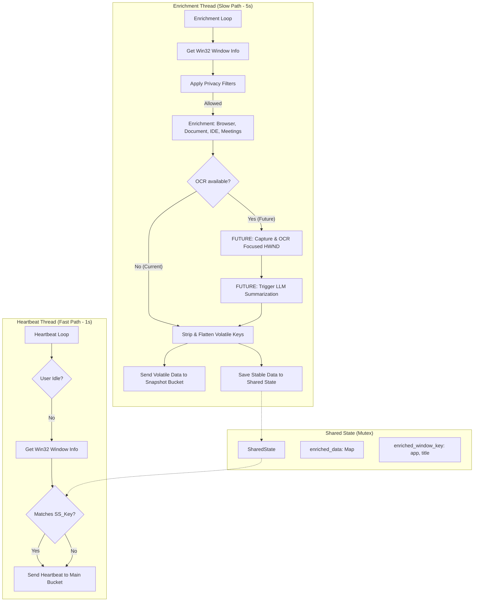
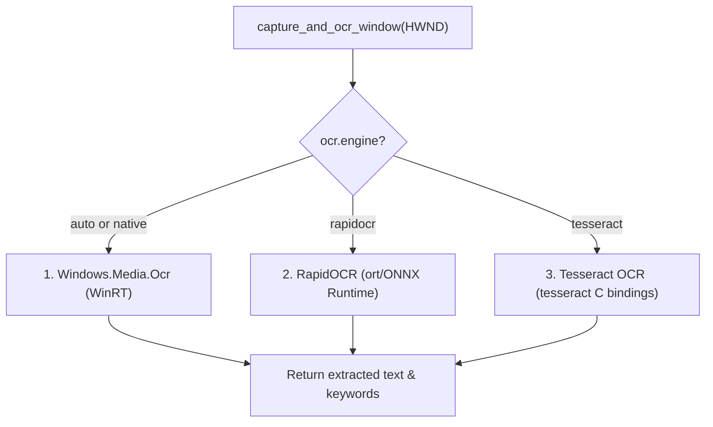

# aw-watcher-enhanced: Windows OCR & LLM Analysis

This document provides a technical analysis of the **OCR (Optical Character Recognition)** and **LLM (Large Language Model)** enhanced features within the `rust-watcher/` subfolders, framed specifically for the **Windows platform**. It explains how the watcher operates under Windows, why the enhanced features are currently inactive, and provides a concrete engineering design to achieve full feature parity with macOS.

---

## 1. Executive Summary

On Windows 10/11, `aw-watcher-enhanced` operates as a robust window-tracking application. However, there is currently a platform gap:
- **Core Tracking (`window.rs`)** is fully operational on Windows, using Win32 APIs to capture focused applications (e.g. `chrome.exe`) and window titles.
- **OCR (`ocr.rs`)** is currently disabled on Windows (`available = false`), as the implementation is macOS-exclusive in the codebase.
- **LLM (`llm.rs`)** is cross-platform but remains inactive on Windows because it relies on OCR text to trigger.
- **Feature Parity Goal**: To achieve true parity with macOS, we outline how to implement a native Windows OCR engine utilizing Win32 GDI screen capture and the native `Windows.Media.Ocr` WinRT APIs.

---

## 2. Threading Model & Shared State on Windows

The application runs two threads to isolate lightweight active window tracking from heavy enrichment/AI operations.



### Key References
- **`SharedState` Struct**: [main.rs:L51-57](file:///c:/projects/aw-watcher-enhanced/rust-watcher/src/main.rs#L51-L57) — Holds the active enriched data.
- **Enrichment Thread**: [main.rs:L160-481](file:///c:/projects/aw-watcher-enhanced/rust-watcher/src/main.rs#L160-L481) — Loops periodically or upon window change to process active window info.
- **Heartbeat Thread**: [main.rs:L483-581](file:///c:/projects/aw-watcher-enhanced/rust-watcher/src/main.rs#L483-L581) — Heartbeats every 1s, reusing enriched cache.

---

## 3. Core Window Tracking on Windows

On Windows, window capture is fast, low-overhead, and does not require accessibility permissions like macOS.

### Win32 API Implementation
In [window.rs:L393-440](file:///c:/projects/aw-watcher-enhanced/rust-watcher/src/window.rs#L393-L440), window tracking uses the standard Win32 APIs via the `windows` crate:
1. **`GetForegroundWindow()`** [window.rs:L406](file:///c:/projects/aw-watcher-enhanced/rust-watcher/src/window.rs#L406) retrieves the active window handle (`HWND`).
2. **`GetWindowTextW()`** [window.rs:L413](file:///c:/projects/aw-watcher-enhanced/rust-watcher/src/window.rs#L413) reads the window's text title into a UTF-16 buffer, which is converted to a Rust `String`.
3. **`GetWindowThreadProcessId()`** [window.rs:L418](file:///c:/projects/aw-watcher-enhanced/rust-watcher/src/window.rs#L418) gets the PID owning the active window.
4. **`GetModuleFileNameExW()`** [window.rs:L430](file:///c:/projects/aw-watcher-enhanced/rust-watcher/src/window.rs#L430) retrieves the full executable path of the process, extracting the basename (e.g. `idea64.exe` or `chrome.exe`) in [window.rs:L436-438](file:///c:/projects/aw-watcher-enhanced/rust-watcher/src/window.rs#L436-L438) as the application name.

---

## 4. The OCR Disparity & Plan for Feature Parity

Currently, `OcrEngine` initializes with `available = false` on Windows, causing OCR runs to return `None` immediately:
- **Disparity Source**: [ocr.rs:L29](file:///c:/projects/aw-watcher-enhanced/rust-watcher/src/ocr.rs#L29) sets `available = cfg!(target_os = "macos")`.
- **Early Exit**: [ocr.rs:L56-58](file:///c:/projects/aw-watcher-enhanced/rust-watcher/src/ocr.rs#L56-L58) returns `None` on Windows because `available` is false.

To establish **feature parity**, we design a native Windows OCR pipeline matching the macOS architecture.

```mermaid
sequenceDiagram
    autonumber
    participant E as Enrichment Thread
    participant W as window.rs
    participant O as "ocr.rs (OcrEngine)"
    participant G as Win32 GDI Graphics
    participant WIN as "Windows.Media.Ocr (WinRT)"

    E->>O: capture_and_ocr_window(Option[HWND])
    Note over O: Throttling & Platform Validation Passed (Windows)
    
    rect rgb(20, 20, 30)
        Note over O: 1. Win32 GDI Screen Capture
        O->>G: GetDC(HWND) & CreateCompatibleDC()
        O->>G: CreateCompatibleBitmap() & SelectObject()
        O->>G: BitBlt() (Copy pixel buffers)
        G-->>O: Raw HBITMAP Pixel Buffer
    end

    rect rgb(30, 20, 20)
        Note over O: 2. WinRT OCR Execution
        O->>WIN: Create SoftwareBitmap from buffer
        O->>WIN: OcrEngine::TryCreateFromUserProfileLanguages()
        O->>WIN: OcrEngine::RecognizeAsync(SoftwareBitmap)
        WIN-->>O: Return OcrResult containing TextLines
    end

    O->>O: extract_keywords() (Filter out GUI stop words)
    O->>G: DeleteObject(HBITMAP) & ReleaseDC() (Prevent memory leaks)
    O-->>E: Return OcrResult { full_text, keywords }
```



### Technical Blueprint for Windows OCR Implementation

To implement this, we require additional features in the `windows` crate inside `Cargo.toml` to access WinRT Graphics, Imaging, Streams, and Media OCR APIs:

#### A. Cargo.toml Additions
```toml
[target.'cfg(target_os = "windows")'.dependencies]
windows = { version = "0.58", features = [
    # Existing features...
    "Win32_Foundation",
    "Win32_Graphics_Gdi",
    # New features required for WinRT OCR:
    "Foundation",
    "Graphics_Imaging",
    "Storage_Streams",
    "Media_Ocr",
] }
```

#### B. The Windows GDI Capture Code
A target window's bitmap can be copied into memory from its Win32 window handle (`HWND`):
```rust
unsafe fn capture_window_bitmap(hwnd: HWND) -> Result<HBITMAP, String> {
    let hdc_screen = GetDC(hwnd);
    let hdc_mem = CreateCompatibleDC(hdc_screen);
    
    let mut rect = RECT::default();
    GetClientRect(hwnd, &mut rect);
    let width = rect.right - rect.left;
    let height = rect.bottom - rect.top;

    let hbitmap = CreateCompatibleBitmap(hdc_screen, width, height);
    let old_obj = SelectObject(hdc_mem, hbitmap);
    
    // Copy pixels from window screen DC to memory DC
    BitBlt(hdc_mem, 0, 0, width, height, hdc_screen, 0, 0, SRCCOPY).map_err(|e| e.to_string())?;
    
    // Clean up DC handles
    SelectObject(hdc_mem, old_obj);
    DeleteDC(hdc_mem);
    ReleaseDC(hwnd, hdc_screen);

    Ok(hbitmap)
}
```

#### C. Calling Windows.Media.Ocr (WinRT)
Once the bitmap is in memory, it is loaded into a WinRT `SoftwareBitmap` and processed by the native system OCR engine:
```rust
use windows::Graphics::Imaging::SoftwareBitmap;
use windows::Media::Ocr::OcrEngine;
use windows::Storage::Streams::InMemoryRandomAccessStream;

unsafe fn run_windows_ocr(hbitmap: HBITMAP) -> Result<String, String> {
    // 1. Convert HBITMAP raw pixels into WinRT SoftwareBitmap...
    // 2. Instantiate system-native OcrEngine
    let engine = OcrEngine::TryCreateFromUserProfileLanguages()
        .map_err(|e| format!("Failed to create Windows OCR engine: {e}"))?;
        
    // 3. Run OCR asynchronously and block synchronously for the result
    let software_bitmap = convert_hbitmap_to_software_bitmap(hbitmap)?;
    let ocr_result = engine.RecognizeAsync(&software_bitmap)
        .map_err(|e| format!("OCR recognition failed: {e}"))?
        .get() // Block on Windows WinRT AsyncOperation
        .map_err(|e| format!("Failed to retrieve OCR output: {e}"))?;
        
    let text = ocr_result.Text()
        .map_err(|e| format!("Failed to read text: {e}"))?
        .to_string();

    Ok(text)
}
```

#### D. Multi-Engine Routing (Including RapidOCR and Tesseract)

To align the Rust watcher with the multi-engine capabilities described in the documentation, `OcrEngine` can route requests based on the `ocr.engine` configuration parameter:



##### 1. RapidOCR in Rust (via ONNX Runtime)
To achieve RapidOCR parity in the native Rust binary without Python, we can compile ONNX model execution directly into the watcher using the **`ort`** crate (high-performance Rust bindings for Microsoft's ONNX Runtime):
- **Cargo.toml Dependencies**:
  ```toml
  [dependencies]
  ort = "2.0"       # ONNX Runtime bindings in Rust
  image = "0.25"   # Raw GDI bitmap conversion & tensor pre-processing
  ```
- **Execution Pipeline**:
  1. **Pre-processing**: Convert the captured GDI `HBITMAP` into a raw RGB byte array, and wrap it in an `image::DynamicImage`. Pre-process it into a normalized Float32 tensor matching the input shape of the ONNX models.
  2. **Text Detection (DBNet)**: Load the DBNet ONNX model via `ort::Session::builder()`. Run the image tensor through the session to obtain a heat map of text regions, and extract the bounding boxes.
  3. **Text Recognition (CRNN)**: For each detected text box, crop the sub-image, normalize it, and feed it into a CRNN ONNX recognition model session to perform character classification.
  4. **Output**: Stitch the classified characters back into lines of text, then pass the result to `extract_keywords()`.

##### 2. Tesseract OCR in Rust
As a secondary cross-platform fallback, the Rust watcher can bind to a local system installation of Google Tesseract:
- **Cargo.toml Dependencies**:
  ```toml
  [dependencies]
  tesseract = "0.14" # Rust C++ bindings to the libtesseract library
  ```
- **Execution Pipeline**:
  1. Initialize the C++ Tesseract API via `tesseract::Tesseract::new_with_data()`.
  2. Convert the captured `HBITMAP` into a PNG memory buffer using the `image` crate.
  3. Pass the memory buffer directly to the API using `set_image_from_mem()`.
  4. Call `get_text()` to retrieve raw character outputs.

---

## 5. LLM Integration on Windows

Because OCR is currently inactive on Windows, the LLM client in `llm.rs` is never invoked. Once Windows OCR is implemented to achieve feature parity, the LLM module is already fully operational and cross-platform:
- **`LlmClient`**: Connects via HTTP using the standard `reqwest` crate [llm.rs:L120-129](file:///c:/projects/aw-watcher-enhanced/rust-watcher/src/llm.rs#L120-L129), making it natively compatible with Windows.
- **Model Support**: Fully supports local Windows instances of **Ollama** (`http://localhost:11434`) and remote **OpenAI-compatible APIs** (e.g. LM Studio, local AI gateways) using `config.toml` parameters.
- **Prompting**: Uses the same `TEXT_SUMMARIZE_PROMPT` [llm.rs:L17-24](file:///c:/projects/aw-watcher-enhanced/rust-watcher/src/llm.rs#L17-L24) to return structured JSON containing keywords, client, project, and activity summary.

---

## 6. Volatile vs. Stable Data & Storage Architecture on Windows

Due to the lack of OCR execution, the data saved on Windows has specific characteristics:
1. **Stable Data (Main Bucket)**: Keeps recording window events normally containing `app`, `title`, `doc_file`, `doc_project`, `doc_type` (via document parser), and `category`. Because no OCR triggers, fields like `ocr_client` are missing.
2. **Volatile Data (Snapshot Bucket)**: High-frequency snapshot data only saves `recent_files` and `os_events` (if active). OCR fields like `ocr_keywords` and `ocr_summary` are skipped.
3. **Parity Outcome**: Once the proposed Windows OCR implementation is merged, the enrichment thread will instantly start stripping out the volatile OCR data and funneling it to the snapshot bucket, preserving identical database architecture between macOS and Windows.

---

## 7. Recommended Windows Configuration

To verify the cross-platform features and prepare the system for local Ollama summarization once OCR parity is added, use the following `%LOCALAPPDATA%\activitywatch\aw-watcher-enhanced\config.toml` structure:

```toml
[watcher]
# Frequency of active window polling in seconds
heartbeat_interval = 1.0 
# Frequency of background enrichment runs in seconds
poll_time = 5.0 

[smart_capture]
# Minimum threshold (in seconds) before marking user as idle
idle_threshold = 60.0 
# Minimum interval allowed between screen capture runs (throttles CPU)
min_ocr_interval = 5.0 

[ocr]
# Enable OCR processing (Requires macOS, or FUTURE Windows update)
enabled = true 
# Maximum unique keywords to save per cycle
max_keywords = 20 

[llm]
# Set to true if local Ollama or OpenAI compatible model is running
enabled = false 
provider = "ollama" 
base_url = "http://localhost:11434" 
model = "gemma3:4b" 
request_timeout = 10.0 
```
